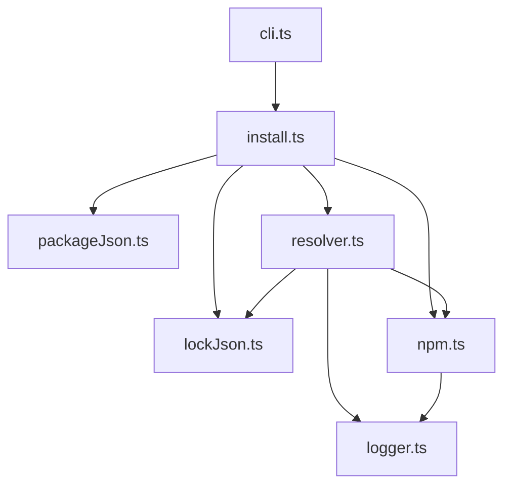
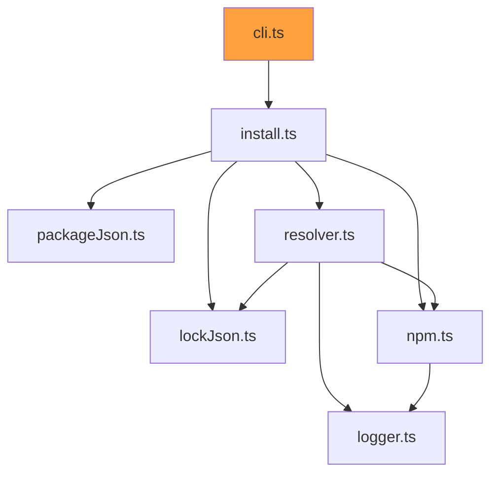
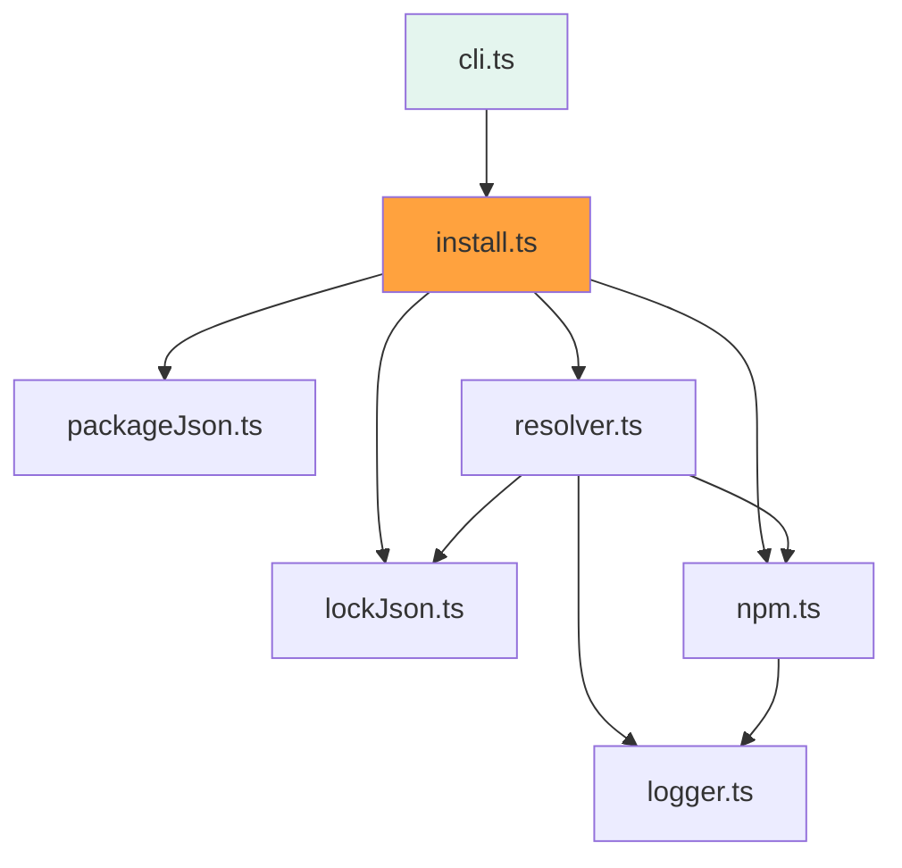
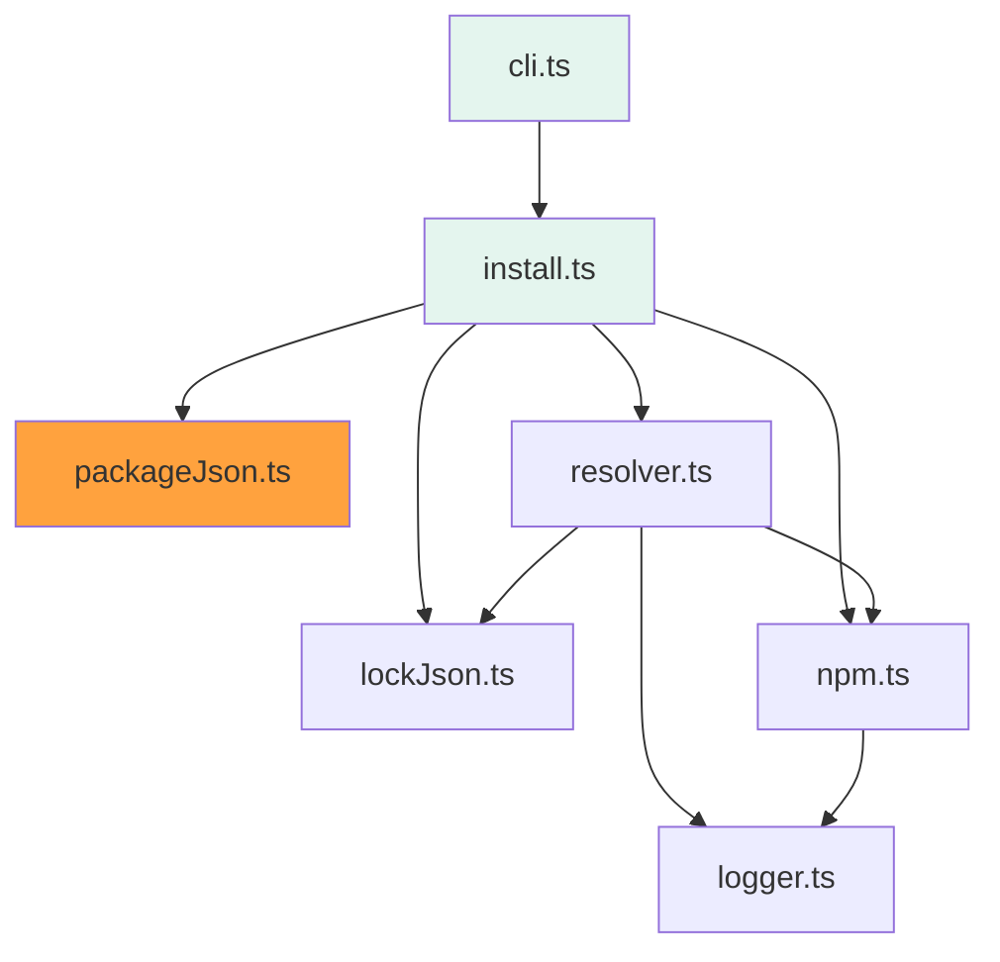
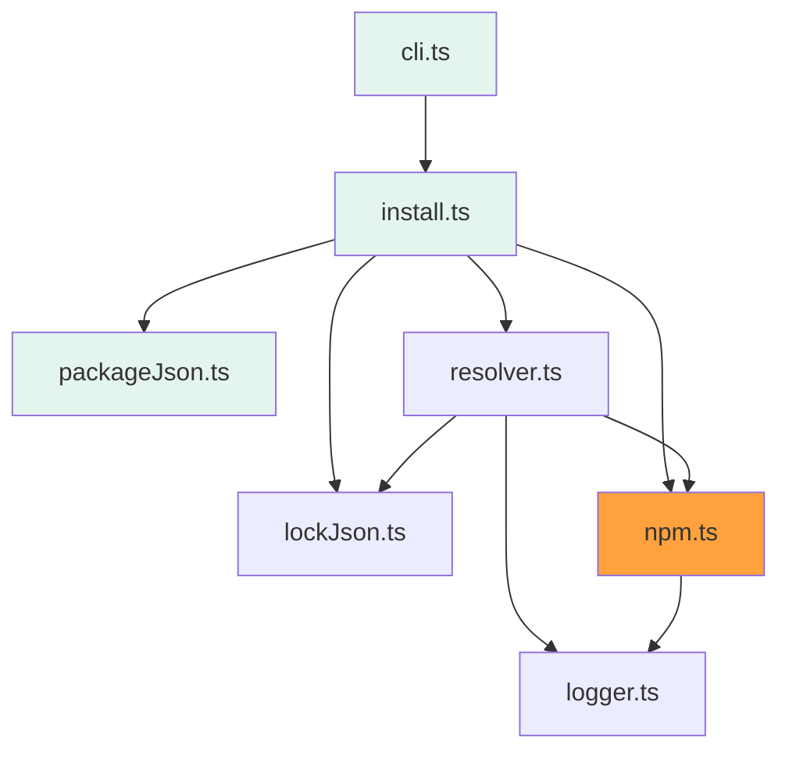
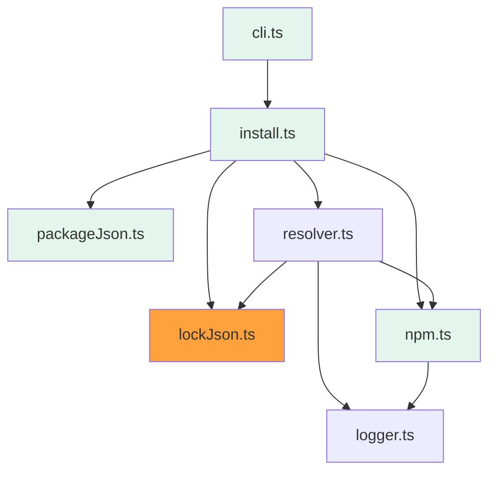
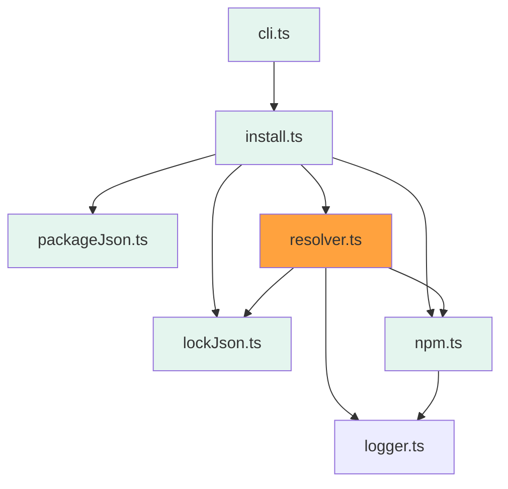
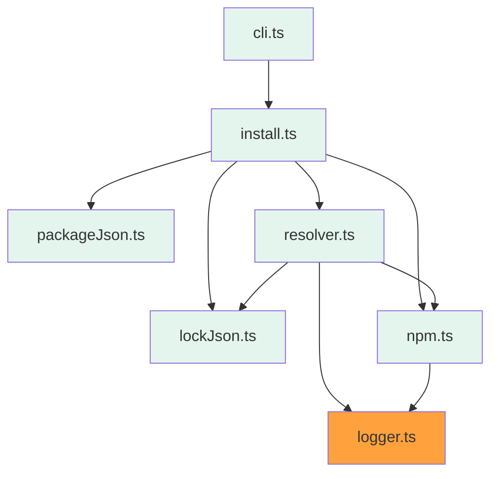

# 概要

本記事では、 [`npm`](https://www.npmjs.com/) や [`yarn`](https://yarnpkg.com/) などの、[Node.js](https://nodejs.org/) におけるパッケージマネージャーを自作することで、その仕組みや挙動の理解を深めようという取り組みを整理した記事になります。

想定読者は以下を満たす人です。

- 普段 `npm` や `yarn` などのパッケージマネージャを使用している
- `package.json` 内の `dependencies` `devDependencies` ぐらいはわかる
- npm リポジトリの構成や、パッケージインストールの仕組みとか全然わからんけど、興味がないこともない
- TypeScript のコードをまぁまぁ読み書きできる

筆者自身も上記のレベルのため、パッケージマネージャに詳しい方が見たら鼻で笑うレベルの内容でもあるので、どうぞお手柔らかにお願いします。

# 注意事項

- 本記事ではソースコードを断片的に記載していますが、ハンズオン形式にはなっていないため、コードの全容については[リポジトリ](https://github.com/s-sasaki-0529/sasaki-package-manager)を参照してください
- **本記事で作成するパッケージマネージャーは、学習用の非常にミニマムなツールであるため、最小限の機能しか実装せず、それもエッジケースやエラーハンドリング、セキュリティなどが欠けたものなので、使用の際はご注意ください**
- `npm` や `yarn` などのソースコードを読んだわけではないので、実装内容は参考元リポジトリ(後述)をベースとした独自のもので、誤りや非効率性を多分に含む可能性があります

# 参考元リポジトリ

本記事は以下のリポジトリから影響を受けた取り組みであるため、ツールのスコープは実装方針のベースとなっています。

https://github.com/g-plane/tiny-package-manager

ただし、実装自体は写経ではなく自分でゼロベースで書いているため、内容が異なる箇所もあります。

# 本ツールについて

今回作成したパッケージマネージャー `sasaki-package-manager` (以降、`本ツール`) は、[GitHub](https://github.com/s-sasaki-0529/sasaki-package-manager) 及び [npm](https://www.npmjs.com/package/sasaki-package-manager) で公開されています。

https://github.com/s-sasaki-0529/sasaki-package-manager

本ツールは CLI 形式で、唯一のサブコマンド `install` を提供します。　`install` では以下のことを行えます。(逆に言うとそれ以外は一切できないですし、バグや考慮漏れも多いです)

- カレントディレクトリ上の `package.json` の記述に基づいたパッケージのインストール
- セマンティックバージョニングによるバージョン指定と解決
- `--production` オプションによる、 `devDependencies` の省略
- `--save-dev` オプションによる、 `devDependencies` への追加
- Lockfile の生成と利用
- dependency of dependency 間でのバージョンコンフリクトの解消

# デモ

## セットアップ

npm 経由で CLI を公開しているので、 `-g` 付きでインストールします。

```bash
$ npm install -g sasaki-package-manager
```

実行ファイル `sasaki-pm` にパスが通って、CLI を利用できるようになります。

```bash
$ sasaki-pm
Usage: sasaki-pm [options] [command]

Options:
  --production               install only dependencies (not devDependencies)
  --save-dev                 Package will appear in your devDependencies
  -h, --help                 display help for command

Commands:
  install [packageNames...]
  help [command]             display help for command
```

上記 CLI の Usage の通り、 `sasaki-pm` コマンドは唯一のサブコマンド `install` を提供します。

`install` は カレントディレクトリの `package.json` に定義されているパッケージに加え、コマンドラインオプションとして続けて指定された `packageNames...` に基づいてパッケージのインストールを行います。

## `sasaki-pm install` を使ってみる

本ツールでは、カレントディレクトリから最寄りの `package.json` を参照するので、動作確認用のディレクトリ及び `package.json` を作成します。

```bash
$ mkdir sasaki-pm-demo
$ cd sasaki-pm-demo
$ touch package.json
```

```json:package.json
{
  "name": "sasaki-pm-demo",
  "version": "1.0.0"
}
```

では試しに [axios](https://github.com/axios/axios) をインストールしてみます。

```bash
$ sasaki-pm install axios
[Resolve by manifest] axios@* to 0.27.2
[Resolve by manifest] axios@^0.27.2 to 0.27.2
[Resolve by manifest] follow-redirects@^1.14.9 to 1.15.1
[Resolve by manifest] form-data@^4.0.0 to 4.0.0
[Resolve by manifest] asynckit@^0.4.0 to 0.4.0
[Resolve by manifest] combined-stream@^1.0.8 to 1.0.8
[Resolve by manifest] delayed-stream@~1.0.0 to 1.0.0
[Resolve by manifest] mime-types@^2.1.12 to 2.1.35
[Resolve by manifest] mime-db@1.52.0 to 1.52.0
[Installed] axios@0.27.2 > node_modules/axios
[Installed] follow-redirects@1.15.1 > node_modules/follow-redirects
[Installed] form-data@4.0.0 > node_modules/form-data
[Installed] asynckit@0.4.0 > node_modules/asynckit
[Installed] combined-stream@1.0.8 > node_modules/combined-stream
[Installed] delayed-stream@1.0.0 > node_modules/delayed-stream
[Installed] mime-types@2.1.35 > node_modules/mime-types
[Installed] mime-db@1.52.0 > node_modules/mime-db
```

それらしいログが出て、 `axios` 及びそこから[依存](https://github.com/axios/axios/blob/649d739288c8e2c55829ac60e2345a0f3439c730/package.json#L106-L110)する `follow-redirects` `form-data` `proxy-from-env` が再帰的に解決されているように見えます。

`node_modules` 以下のディレクトリツリーを見てみると、実際にインストールされていることが確認できます。

```bash
$ tree node_modules/ -L 2
node_modules/
├── asynckit
│   ├── LICENSE
│   ├── README.md
│   ├── bench.js
│   ├── index.js
│   ├── lib
│   ├── package.json
│   ├── parallel.js
│   ├── serial.js
│   ├── serialOrdered.js
│   └── stream.js
├── axios
│   ├── CHANGELOG.md
│   ├── LICENSE
│   ├── README.md
│   ├── SECURITY.md
│   ├── UPGRADE_GUIDE.md
│   ├── dist
│   ├── index.d.ts
│   ├── index.js
│   ├── lib
│   ├── package.json
│   ├── tsconfig.json
│   └── tslint.json
├── combined-stream
│   ├── License
│   ├── Readme.md
│   ├── lib
│   ├── package.json
│   └── yarn.lock
├── delayed-stream
│   ├── License
│   ├── Makefile
│   ├── Readme.md
│   ├── lib
│   └── package.json
├── follow-redirects
│   ├── LICENSE
│   ├── README.md
│   ├── debug.js
│   ├── http.js
│   ├── https.js
│   ├── index.js
│   └── package.json
├── form-data
│   ├── License
│   ├── README.md.bak
│   ├── Readme.md
│   ├── index.d.ts
│   ├── lib
│   └── package.json
├── mime-db
│   ├── LICENSE
│   ├── db.json
│   └── index.js
└── mime-types
    ├── HISTORY.md
    ├── LICENSE
    ├── README.md
    ├── index.js
    └── package.json
```

また、 `package.json` にも追加した `axios` への依存が記述されています。

```json:package.json
{
  "name": "sasaki-pm-demo",
  "version": "1.0.0",
  "dependencies": {
    "axios": "^0.27.2"
  }
}
```

さらに、解決完了したパッケージについては再インストール時に解決処理を省略することや、同じバージョンを使い続けられるよう、 `npm`　における[`package.lock.json`](https://docs.npmjs.com/cli/v8/configuring-npm/package-lock-json) にあたる `sasaki-pm.lock.json` が生成されます。

```json:sasaki-pm.lock.json
{
  "asynckit@^0.4.0": {
    "version": "0.4.0",
    "url": "https://registry.npmjs.org/asynckit/-/asynckit-0.4.0.tgz",
    "shasum": "c79ed97f7f34cb8f2ba1bc9790bcc366474b4b79",
    "dependencies": {}
  },
  "axios@^0.27.2": {
    "version": "0.27.2",
    "url": "https://registry.npmjs.org/axios/-/axios-0.27.2.tgz",
    "shasum": "207658cc8621606e586c85db4b41a750e756d972",
    "dependencies": {
      "follow-redirects": "^1.14.9",
      "form-data": "^4.0.0"
    }
  },
  "combined-stream@^1.0.8": {
    "version": "1.0.8",
    "url": "https://registry.npmjs.org/combined-stream/-/combined-stream-1.0.8.tgz",
    "shasum": "c3d45a8b34fd730631a110a8a2520682b31d5a7f",
    "dependencies": {
      "delayed-stream": "~1.0.0"
    }
  },
  "delayed-stream@~1.0.0": {
    "version": "1.0.0",
    "url": "https://registry.npmjs.org/delayed-stream/-/delayed-stream-1.0.0.tgz",
    "shasum": "df3ae199acadfb7d440aaae0b29e2272b24ec619",
    "dependencies": {}
  },
  "follow-redirects@^1.14.9": {
    "version": "1.15.1",
    "url": "https://registry.npmjs.org/follow-redirects/-/follow-redirects-1.15.1.tgz",
    "shasum": "0ca6a452306c9b276e4d3127483e29575e207ad5",
    "dependencies": {}
  },
  "form-data@^4.0.0": {
    "version": "4.0.0",
    "url": "https://registry.npmjs.org/form-data/-/form-data-4.0.0.tgz",
    "shasum": "93919daeaf361ee529584b9b31664dc12c9fa452",
    "dependencies": {
      "asynckit": "^0.4.0",
      "combined-stream": "^1.0.8",
      "mime-types": "^2.1.12"
    }
  },
  "mime-db@1.52.0": {
    "version": "1.52.0",
    "url": "https://registry.npmjs.org/mime-db/-/mime-db-1.52.0.tgz",
    "shasum": "bbabcdc02859f4987301c856e3387ce5ec43bf70",
    "dependencies": {}
  },
  "mime-types@^2.1.12": {
    "version": "2.1.35",
    "url": "https://registry.npmjs.org/mime-types/-/mime-types-2.1.35.tgz",
    "shasum": "381a871b62a734450660ae3deee44813f70d959a",
    "dependencies": {
      "mime-db": "1.52.0"
    }
  }
}
```

もう一例、 [typescript](https://github.com/microsoft/TypeScript) をバージョン指定付きで、 `devDependencies` の方に追加してみます。

```bash
$ sasaki-pm install --save-dev typescript@^4.6.0
[Resolve by lockfile] axios@^0.27.2 to 0.27.2
[Resolve by lockfile] follow-redirects@^1.14.9 to 1.15.1
[Resolve by lockfile] form-data@^4.0.0 to 4.0.0
[Resolve by lockfile] asynckit@^0.4.0 to 0.4.0
[Resolve by lockfile] combined-stream@^1.0.8 to 1.0.8
[Resolve by lockfile] delayed-stream@~1.0.0 to 1.0.0
[Resolve by lockfile] mime-types@^2.1.12 to 2.1.35
[Resolve by lockfile] mime-db@1.52.0 to 1.52.0
[Resolve by manifest] typescript@^4.6.0 to 4.8.2
[Installed] axios@0.27.2 > node_modules/axios
[Installed] follow-redirects@1.15.1 > node_modules/follow-redirects
[Installed] form-data@4.0.0 > node_modules/form-data
[Installed] asynckit@0.4.0 > node_modules/asynckit
[Installed] combined-stream@1.0.8 > node_modules/combined-stream
[Installed] delayed-stream@1.0.0 > node_modules/delayed-stream
[Installed] mime-types@2.1.35 > node_modules/mime-types
[Installed] mime-db@1.52.0 > node_modules/mime-db
[Installed] typescript@4.8.2 > node_modules/typescript
```

`[Resolve by manifest] typescript@^4.6.0 to 4.8.2` の通り、`package.json` の `devDependencies` のほうに、指定したバージョン制約を満たす最新バージョンがインストールできたことがわかります。

```json:package.json
{
  "name": "sasaki-pm-demo",
  "version": "1.0.0",
  "dependencies": {
    "axios": "^0.27.2"
  },
  "devDependencies": {
    "typescript": "^4.6.0"
  }
}
```

また、最初に追加していた `axios` については `[Resolve by lockfile] axios@^0.27.2 to 0.27.2` のログの通り、 Lockfile から解決されているため、バージョン解決を省略した上、今後新バージョンが出ても解決済みのバージョンで固定することができます。

他にも、ここでの紹介は割愛しますが、 `package.json` を直接書き換えた場合の追従や、 `--production` オプションを付与することで `devDependencies` のインストールを省略するなども実装しています。

# 実装

ここからは、本ツールの実装を、`npm` の仕組みと合わせてご紹介します。

なお、以降で登場する `npm` は、パッケージマネージャーとしての `npm`(コマンド) と、パッケージレジストリとしての `npm` が混在することがあるのでご注意ください。

## モジュール構成

以下が本ツールの全モジュールとその依存関係です。ファイルも [`/src`](https://github.com/s-sasaki-0529/sasaki-package-manager/tree/main/src) 直下に全て定義されています。



|モジュール名|役割|
|---|---|
|`cli`|ユーザーからのコマンド入力を受け取るエントリーポイント|
|`install`|install コマンドのメイン処理部分で、現状唯一提供しているコマンド|
|`packageJson`|package.json ファイルの読み書きを行う|
|`lockJson`|sasaki-pm.lock.json ファイルの読み書きを行う|
|`npm`|npmリポジトリからのマニフェストの取得や、パッケージのダウンロードを行う|
|`resolver`|npm リポジトリ及び Lockfile を使用してパッケージの依存解決を行う|
|`logger`|各種ログ出力|

以降に掲載する全てのコードは、上記いずれかのモジュールに含まれますが、コードの一部を省略することがあるので適宜読み替えてください。

## cli

[`cli` モジュール](https://github.com/s-sasaki-0529/sasaki-package-manager/blob/main/src/cli.ts)は、ユーザーからのコマンド及びオプションの入力を受け取るインタフェースを提供します。



`Node.js` における cli を簡単に作成するためのツールはいくつかありますが、今回は人気が高く、型情報がビルトインである `Commander.js` を採用しました。

https://github.com/tj/commander.js/

`Commander.js` はシンプルな API を用いてコマンドやオプションの定義が可能で、ヘルプコマンドも自動で生成される点が気に入りました。

本ツールでは `install` コマンドのみを提供し、そのパラメータとして可変長な `packageNames` と、オプションとして `--production` `--save-dev` を提供します。

```ts:src/cli.ts
import { Command } from 'commander'
import install from './install.js'

const program = new Command()

program
  .command('install')
  .argument('[packageNames...]')
  .action(async packageNames => {
    const options = program.opts()
    await install(packageNames, {
      saveDev: !!options.saveDev,
      production: !!options.production
    })
    process.exit(0)
  })

program
  .option('--production', 'install only dependencies (not devDependencies)')
  .option('--save-dev', 'Package will appear in your devDependencies')
  .parse()
```

これだけで、コマンドを省略してスクリプトを実行した場合に以下のようなヘルプが表示されます。

```bash
$ sasaki-pm
Usage: sasaki-pm [options] [command]

Options:
  --production               install only dependencies (not devDependencies)
  --save-dev                 Package will appear in your devDependencies
  -h, --help                 display help for command

Commands:
  install [packageNames...]
  help [command]             display help for command
```

`install` コマンドを指定した場合に、パラメータとオプションを `install` モジュールに引き渡すことで、`cli` モジュールの役割は終わります。

## install

[`install` モジュール](https://github.com/s-sasaki-0529/sasaki-package-manager/blob/main/src/install.ts)は、`sasaki-pm install` コマンドを実行するメインのモジュールです。



本モジュールは、唯一の関数 `install` をデフォルトエクスポートします。

```ts:src/install.ts
export default async function install(packageNames: PackageName[], option: InstallOption = {}) {}
```

`install` 関数で処理の細部を他のモジュールに委譲しますが、全体として以下のステップでインストールを実行します。

1. `package.json` を読み込む
2. `sasaki-pm.lock.json` を読み込む
3. 追加パッケージのバージョンを解決する
4. `--production` オプションがあれば devDependencies を除外する
5. すべてのパッケージの依存解決を行う
6. すべてのパッケージの tar をダウンロードし、解凍する
7. ファイルに結果を書き出す

### ステップ1: `package.json` を読みこむ

`sasaki-pm install` でインストールするパッケージは `package.json` に基づいて決定します。詳細は後述しますが、以下のようにカレントディレクトリ上の `package.json` を読み込み、 `dependencies` / `devDependencies` を設定します。

```ts:src/install.ts
  // カレントディレクトリにある package.json の内容から依存関係を取得する
  const packageJson = await parsePackageJson() // refs: src/packageJson.ts
```

例えば `axios` と `typescript` への依存が記述された `package.json` なら、変数 `packageJson` は以下のようになります。

```ts
{
  dependencies: {
    axios: '^0.2.7'
  },
  devDependencies: {
    typescript: '^4.0.0'
  }
}
```

`dependencies` と `devDependencies` の違いについては以下参照。

https://qiita.com/chihiro/items/ca1529f9b3d016af53ec

### ステップ2: `sasaki-pm.lock.json` を読み込む

`npm` における `package.lock.json` や、 `yarn` における `yarn.lock` は、パッケージ解決及びインストール後にその情報を記録しておき、次回以降 install する際に、その情報を元にインストールできるようにします。

Lockfile があることで、以下のようなメリットがあります。

- パッケージ全体の依存ツリーを正確に表現することで、開発者間、デプロイ間、CI間で常に同じバージョンのパッケージを利用できる
- `node_modules` のその時の状態をバージョン管理(e.g. `git`) できるようになり、ロールバックも可能になる
- パッケージインストール時に、マニフェストの取得やバージョンの解決をスキップできるようになり、パフォーマンスが向上する

本ツールでもこれに倣って、`sasaki-pm.lock` を生成、参照できるようにしますが、ここではまず現在の Lockfile をメモリに読み込んでおいて参照できる状態にしておきます。

```ts:src/install.ts
  // 依存解決前に sasaki-pm.lock.json を読み込んでおく
  await readLockFile() // refs: src/lockJson.ts
```

Lockfile の役割については以下参照。

https://qiita.com/sugurutakahashi12345/items/1f6bb7a372b8263500e5

### ステップ3： 追加パッケージのバージョンを解決する

ステップ1 では、`package.json` 内に記述されている `dependencies` と `devDependencies` を読み込みましたが、本ツールではそれに加えて、 `sasaki-pm install [packageNames...]` の形式で、現在は `package.json` にないパッケージの追加を行うことができます。

パッケージ追加には、以下のようなパターンがあります。

- `sasaki-pm install axios`: axios の最新バージョンを `dependencies` に追加
- `sasaki-pm install vue@^2.0.0` vue の 2.x 系のうち最新のバージョンを `dependencies` に追加
- `sasaki-pm install typescript --save-dev`: typescript の最新バージョンを `devDependencies` に追加

以上を考慮しながら、以下のように `dependencyMap` に追加します。

```ts
  // コマンドラインオプションで指定された、追加インストールするパッケージを追加する
  // バージョン指定がない場合は、最新バージョンを確認してそれを使用する
  // saveDev オプションが付与されているばあいは devDependencies のほうに追加する
  for (const packageName of packageNames) {
    const hasConstraint = packageName.includes('@')
    const name = hasConstraint ? packageName.split('@')[0] : packageName
    const constraint = hasConstraint ? packageName.split('@')[1] : `^${await resolvePackageLatestVersion(name)}` // refs: src/resolver.ts

    if (option.saveDev) {
      dependencyMap.devDependencies[name] = constraint
    } else {
      dependencyMap.dependencies[name] = constraint
    }
  }
```

バージョンはセマンティックバージョニングに基づいて、バージョン制約を満たす最新のバージョンを使用するようにします。バージョン指定を省略した場合は最新バージョンになります。

セマンティックバージョニングについては以下参照。

https://docs.npmjs.com/about-semantic-versioning

### ステップ4: `--production` オプションがあれば `devDependencies` を除外する

`sasaki-pm install --production` のように、 `--production` オプションが指定された場合は、 `dependencies` のみをインストールの対象とし、 `devDependencies` のインストールを省略します。

以下のように、オプションがない場合は `dependencies` と `devDependencies` をマージするところで、それを省略することで除外します。

```ts:src/install.ts
  // dependencies と devDependenciesをマージして、最終的なパッケージリストを生成する
  // ただし、devDependencies は --production オプションが指定されていない場合に限る
  const dependenciesMap: DependenciesMap = { ...packageJson.dependencies }
  if (!option.production) {
    Object.assign(dependenciesMap, packageJson.devDependencies)
  }
```

### ステップ5: すべてのパッケージの依存解決を行う

パッケージマネージャの肝と言えるのがこのステップです。

`npm` においては、直接依存するパッケージの数がたかが知れても、そのパッケージが依存するパッケージ、さらにその依存パッケージが依存するパッケージとネストしていき、気づけば数え切れないパッケージに依存することが多々あります。

例えば [webpack](https://github.com/webpack/webpack) への依存を一つ追加するだけで、最終的にインストールされるパッケージの数はのべ78個になります。

https://npm.anvaka.com/#/view/2d/webpack

依存解決は非常に複雑なプロセスになり、その一部しかサポートしていない本ツールでもコード量が大きいので、詳細は `resolver` モジュールに委譲します。

ここでは、後述の `collectDepsPackageList` 関数を用いて、全ての依存解決完了後のパッケージリストを取得します。

```ts:src/install.ts
  // 各パッケージの依存関係を解決し、最終的にインストールするパッケージ一覧及び保存ディレクトリを決定する
  const topLevelPackageList: DependenciesMap = {}
  const conflictedPackageList: ConflictedPackageInfo[] = []
  for (const [name, constraint] of Object.entries(dependenciesMap)) {
    // refs: src/resolver.ts
    await collectDepsPackageList(name, constraint, dependenciesMap, topLevelPackageList, conflictedPackageList, [])
  }
```

パッケージリストは `topLevelPackageList` と `conflictedPackageList` の2種類に分かれ、前者は `node_modules/` 直下にインストールされるもの、後者は各依存パッケージのディレクトリ以下(e.g. `node_modules/axios/node_modules`) にインストールされるものです。

なぜこういった分別が必要なのかも後述しますが、ここでは依存解決が完了して、パッケージ名、ダウンロードURL、保存ディレクトがすべて決定したと思っていただければ大丈夫です。


### ステップ6: すべてのパッケージの tar をダウンロードし、解凍する

ステップ5にて、すべての依存解決が完了し、各パッケージのダウンロードURLと保存ディレクトリが決定したので、それを用いてダウンロード及びインストールを行います。

```ts:src/install.ts
  // node_modules 直下にインストールするパッケージから先にインストール
  for (const name of Object.keys(topLevelPackageList)) {
    await installPackage(name, topLevelPackageList[name], `node_modules/${name}`)
  }

  // node_modules 直下とはバージョンコンフリクトが起こった下位パッケージは、各パッケージディレクトリ以下にインストール
  for (const { name, version, parent } of conflictedPackageList) {
    await installPackage(name, version, `node_modules/${parent}/node_modules/${name}`)
  }
```

### ステップ7: ファイルに結果を書き出す

ここまでで全ての依存解決及びインストール作業が完了したので、 `package.json` 及び `sasaki-pm.lock.json` を書き出します。これによって次回 install 時にも同じ状態を保つことができます。

```ts:src/install.ts
  // 最終的な依存関係を package.json 及び sasaki-pm.lock.json に書き出して完了
  await writePackageJson(packageJson) // refs: src/packageJson.ts
  await writeLockFile() // refs: src/lockJson.ts
```

ここまでで `install` モジュールは以上になります。各ステップで、それぞれ別のモジュールの処理を委譲していたので、引き続きそれらを紹介します。

## packageJson

[`packageJson` モジュール](https://github.com/s-sasaki-0529/sasaki-package-manager/blob/main/src/packageJson.ts)は `package.json` の読み書きを行うモジュールです。



### 依存情報の抽出

本ツールが `package.json` に対して読み書きするフィールドは、 `dependencies` / `devDependencies` の2種類のみなので、この型を定義しつつ、これを抜き出す関数を実装します。

```ts:src/type.d.ts
// パッケージ名
type PackageName = string

// バージョン制約(e.g. '^1.0.0')
type VersionConstraint = string

// 依存パッケージ名とバージョン制約のマップ
type DependenciesMap = {
  [name: PackageName]: VersionConstraint | Version
}

// dependencies / devDependencies それぞれのマップ
type PackageDependencyMap = {
  dependencies: DependenciesMap
  devDependencies: DependenciesMap
}
```

特定バージョンを指す `Version` と、[セマンティックバージョニング](https://docs.npmjs.com/about-semantic-versioning) に基づいたバージョンの範囲を示す `VersionConstraint` はどちらも `string` ですが意味論的に使い分けるために型エイリアスを付与しています。

まず、カレントディレクトリ上の `package.json` を読み込み、上記で言う `PackageDependencyMap` 型のオブジェクトを返す関数を実装します。

```ts:src/packageJson.ts
import { readFile } from 'fs/promises'

const PACKAGE_JSON_PATH = `${process.cwd()}/package.json`

/**
 * package.json を parse し、依存関係オブジェクトを返す
 */
export async function parsePackageJson(): Promise<PackageDependencyMap> {
  const data = await readFile(PACKAGE_JSON_PATH, 'utf-8')
  const json = JSON.parse(data.toString())
  return {
    dependencies: json.dependencies || {},
    devDependencies: json.devDependencies || {}
  }
}

// サンプル
// { dependencies: { axios: "^0.27.0" }, devDependencies: { typescript: "^4.7.0"} }
await parsePackageJson('./package.json')
```

本来は `package.json` がカレントディレクトリに存在しない場合、上位ディレクトリに向かって探索するべきですが、本ツールでは実装の簡便さを優先し、カレントディレクトリに必ず存在するものとしています。

ただし、`package.json` が存在しても、 `dependencies` または `devDependencies` フィールドが未定義の場合もあるため、その場合は空オブジェクトで初期化します。

### 依存情報の更新

`sasaki-pm install axios` のように、依存パッケージの追加が行われた場合は `package.json` にその結果を書き込む必要があります。読み込み時とは逆に、 `PackageDependencyMap` 型を渡して `package.json` を更新する関数を実装します。

```ts:src/packageJson.ts
import { writeFile } from 'fs/promises'

const PACKAGE_JSON_PATH = `${process.cwd()}/package.json`

/**
 * package.json を依存関係オブジェクトを用いて書き換える
 */
export async function writePackageJson(dependencyMap: PackageDependencyMap) {
  const data = await readFile(PACKAGE_JSON_PATH)
  const currentJson = JSON.parse(data.toString())
  const newJson = {
    ...currentJson,
    dependencies: dependencyMap.dependencies,
    devDependencies: dependencyMap.devDependencies
  }
  if (Object.keys(newJson.dependencies).length === 0) delete newJson.dependencies
  if (Object.keys(newJson.devDependencies).length === 0) delete newJson.devDependencies
  return writeFile(path, JSON.stringify(newJson, null, 2))
}
```

これで `package.json` の探索及び読み書きの準備が整いました。

## npm

[`npm` モジュール](https://github.com/s-sasaki-0529/sasaki-package-manager/blob/main/src/npm.ts)はその名の通り、 `npm` レジストリへのリクエストを担当します。



### マニフェストについて

`npm` レジストリで公開されている各パッケージは、マニフェストファイルを参照することで、公開されているバージョン一覧や、それぞれが依存するパッケージ一覧などのメタデータを確認することができます。

例えば `axios` の場合、以下がマニフェストURLになります。

https://registry.npmjs.org/axios

*※ このデータのことを「マニフェスト」と呼ぶかはよくわかっていませんが、本ツール及び本記事では便宜上「マニフェスト」と呼称してます*

パッケージのバージョン制約からバージョンを確定したり、依存パッケージの解決を行う上で、このマニフェストが非常に重要になってきます。

まず、マニフェストに記載されているデータのうち、本ツールで使用するフィールドについて型を抜き出して定義しておきます。

```ts:src/type.d.ts
// npm レジストリから取得できるマニフェストの型(必要分のみ定義)
// e.g. https://registry.npmjs.org/axios
type NpmManifest = {
  name: PackageName
  'dist-tags': {
    latest: Version
  }
  versions: {
    [version: Version]: {
      dist: {
        tarball: string
        shasum: string
      }
      dependencies: DependenciesMap
    }
  }
}
```

パッケージ名と最新バージョン、それに公開されている各バージョンのダウンロードURLとハッシュ値、そして依存するパッケージの一覧です。(*shasum(ハッシュ値)はダウンロードしたパッケージの検証(改ざん検知)に用いますが、本ツールではそこの実装までは行いませんでした*)

`DependenciesMap` については `packageJson` でも登場しましたが、以下の形式のオブジェクトです。

```ts
{
  "follow-redirects": "^1.14.9",
  "form-data": "^4.0.0"
}
```

本ツールでは、依存パッケージを使用するための依存パッケージをインストールできれば充分なので、ここでは `dependencies` のみで、 `devDependencies` は不要になります。

### マニフェストの取得

指定したパッケージのマニフェストを取得する関数を実装します。

複数のパッケージから同一のパッケージへの依存がある場合もあるので、一度取得したマニフェストはキャッシュを残すようにします。

```ts:src/npm.ts
import fetch from 'node-fetch'

// npm レジストリURL
const REGISTRY_URL = 'https://registry.npmjs.org'

// 取得済みの npm マニフェストをメモリにキャッシュするためのマップ
const MANIFEST_CACHE: Record<PackageName, NpmManifest> = {}

/**
 * npm リポジトリからパッケージのマニフェストを取得する
 * 一度取得したマニフェストはキャッシュされ再利用される
 */
export async function fetchPackageManifest(name: PackageName): Promise<NpmManifest> {
  if (!MANIFEST_CACHE[name]) {
    const manifestUrl = `${REGISTRY_URL}/${name}`
    const manifest = (await fetch(manifestUrl).then(res => res.json())) as NpmManifest
    MANIFEST_CACHE[name] = manifest
  }
  return MANIFEST_CACHE[name]
}

// サンプル
// https://registry.npmjs.org/axios と同じ内容
await fetchPackageManifest('axios')
```

### パッケージのダウンロード

前項で取得したマニフェストには、各バージョンごとの `tar` 形式でホスティングされているパッケージの URL が記載されています。

以下は [axios のマニフェスト](https://registry.npmjs.org/axios) の、 `v0.27.2` の抜粋になりますが、 この場合は `versions["0.27.2"].dist.tarball` がダウンロード用URLになります。

```json
{
  "versions": {
    "0.27.2": {
      "dist": {
        "tarball": "https://registry.npmjs.org/axios/-/axios-0.27.2.tgz",
      }
    }
  }
}
```

これを使って、指定したパッケージの指定バージョンをダウンロードする関数を実装します。なお、`tar` のままだとパッケージの中身が参照できないため、 `node-tar` を用いてこのタイミングで解凍まで行います。

https://github.com/npm/node-tar

```ts:src/npm.ts
import fetch from 'node-fetch'
import * as tar from 'tar'

/**
 * パッケージの指定バージョンをダウンロードし、tar を解答して指定パスに展開する
 */
export async function installPackage(name: PackageName, version: Version, path: string) {
  const fullPath = `${process.cwd()}/${path}`
  const manifest = await fetchPackageManifest(name)

  mkdir(fullPath, { recursive: true })

  const tarballUrl = manifest.versions[version].dist.tarball
  const tarResponse = await fetch(tarballUrl)
  tarResponse.body?.pipe(tar.extract({ cwd: fullPath, strip: 1 }))

  installLog(name, version, path)
}
```

上記関数を用いることで

```ts
await installPackage('axios', '0.27.0', './node_modules')
```

を実行すると、 `./node_modules` 以下に `axios@0.27.0` がインストールされます。

```bash
$ ls node_modules/axios/
CHANGELOG.md     SECURITY.md      index.d.ts       package.json
LICENSE          UPGRADE_GUIDE.md index.js         tsconfig.json
README.md        dist             lib              tslint.json
```

## lockJson

[`lockJson` モジュール](https://github.com/s-sasaki-0529/sasaki-package-manager/blob/main/src/lockJson.ts)は、 `sasaki-package-manager` における Lockfile の読み書きを行います。




### データ構造

本ツールが Lockfile で取り扱うデータ構造は以下になります。


```ts:src/type.d.ts
// 解決済みのパッケージ情報
type ResolvedPackageInfo = {
  version: Version
  url: string
  shasum: string
  dependencies: DependenciesMap
}

// 解決済みパッケージ情報一覧(≒ sasaki-pm.lock.json)
type LockFile = {
  [dependency: string]: ResolvedPackageInfo
}
```

具体的には、 `axios@^0.27.2` を `v0.27.2` で解決した場合、以下のようになります。

```json
  "axios@^0.27.2": {
    "version": "0.27.2",
    "url": "https://registry.npmjs.org/axios/-/axios-0.27.2.tgz",
    "shasum": "207658cc8621606e586c85db4b41a750e756d972",
    "dependencies": {
      "follow-redirects": "^1.14.9",
      "form-data": "^4.0.0"
    }
  },
```

これによって、`package.json` に `axios@^0.27.2` への依存が定義されていて、 `0.27.3` がリリースされていたとしてた場合も、常に `0.27.2` がインストールされるようになりますし、ダウンロード用URL をレジストリから一々取得する必要もなくなります。

*繰り返しになりますが、`shasum` は保持するだけしておいて使うことはありませんでした*

### Lockfile の読み込み

Lockfile の内容はパッケージの依存解決作業の中で各所から参照されるため、変数に読み込んでおきます。

```ts:src/lockJson.ts
import { readFile } from 'fs/promises'

const LOCK_FILE_PATH = `${process.cwd()}/sasaki-pm.lock.json`

// 現在の lock ファイルの内容で読み取り用
const currentLockFile: LockFile = {}

/**
 * sasaki-pm.lock.json を読み込み、メモリに展開する
 */
export async function readLockFile() {
  const buffer = await readFile(LOCK_FILE_PATH, 'utf8').catch(e => {
    if (e.code === 'ENOENT') return '{}'
    throw e
  })
  const lockFile = JSON.parse(buffer) as LockFile
  Object.assign(currentLockFile, lockFile)
  return currentLockFile
}
```

なお、LockFile については存在しない場合も加味して、その場合は空オブジェクトを使用します。

### Lockfile を用いた解決

依存解決の中で、既に Lockfile にパッケージ情報が記録されている場合はそちらを優先して使用するため、読み込まれた Lockfile からパッケージの解決を試みる関数を実装します。

```ts:src/lockJson.ts
/**
 * メモリ上の LockFile からパッケージ情報を取得する
 */
export function readLockedPackageInfo(name: PackageName, vc: VersionConstraint): ResolvedPackageInfo | null {
  const packageInfo = currentLockFile[`${name}@${vc}`]
  if (packageInfo) {
    return {
      version: packageInfo.version,
      url: packageInfo.url,
      shasum: packageInfo.shasum,
      dependencies: packageInfo.dependencies
    }
  } else {
    return null
  }
}
```

Lockfile のキーは `[パッケージ名]@[バージョン制約]` になっているため、それを引数で受け取り、Lockfile 内にあればそれを返します。

ない場合はレジストリからマニフェストを取得するので、ここでは `null` を返します。

### Lockfile への書き込み

前項で、現在の LockFile の内容を変数(`currentLockFile`)で保持しましたが、依存解決が完了したパッケージ情報を新たに書き出すための、書き込み専用の変数(`newLockFile`)も別途用意しておきます。

```ts:src/lockJson.ts
// 更新用の lock ファイルの内容で書き込み用
const newLockFile: LockFile = {}
```

依存解決が完了する都度、これにパッケージ情報を書き込むので、それ用の関数を用意します。

```ts:src/lockJson.ts
/**
 * メモリ上の LockFile にパッケージを追加する
 */
export async function addLockFile(name: PackageName, vc: VersionConstraint, info: ResolvedPackageInfo) {
  newLockFile[`${name}@${vc}`] = info
  return info
}
```

全ての依存解決完了後に、新しい Lockfile をファイルに書き出すための関数も提供します。

```ts:src/lockJson.ts
/**
 * メモリ上の LockFile を sasaki-pm.lock.json に書き込む
 */
export async function writeLockFile() {
  const lockFileJson = JSON.stringify(sortLockfile(newLockFile), null, 2)
  return writeFile(LOCK_FILE_PATH, lockFileJson, 'utf8')
}
```

*[`sortLockfile`](https://github.com/s-sasaki-0529/sasaki-package-manager/blob/f48c1b8bedbdb8a65b08b668c7bf748f8b0c80a4/src/lockJson.ts#L57-L66) はオブジェクトソート用の汎用関数なのでここでは割愛*

## resolver

[`resolver` モジュール](https://github.com/s-sasaki-0529/sasaki-package-manager/blob/main/src/resolver.ts) はインストールするパッケージとそのバージョン制約を元に、インストールするバージョン解決を行うためのモジュールです。



単純に一つのパッケージに対して解決するだけなら簡単な話ですが、パッケージが依存するパッケージ、さらにそれらから依存したパッケージと、依存関係はネストするため、再帰的な解決を行いつつ、バージョンコンフリクトを解消すると言った複雑なプロセスが必要になります。


### バージョン制約を満たすバージョンを特定する

`resolver` モジュールの役割のうち、まずシンプルなのはバージョン制約を元にインストール可能な最新バージョンの情報を取得することです。

受け取ったパッケージ名(`packageName`)及びバージョン制約(`vc`) を元に、インストールすべきパッケージの情報を返す関数 `resolvePackage` 関数が以下になります。

```ts:src/resolver.ts
export async function resolvePackage(packageName: PackageName, vc: VersionConstraint): Promise<ResolvedPackageInfo> {
  // 前略 Lockfile で解決可能ならそっちを優先する

  const manifest = await fetchPackageManifest(packageName)
  const version = semver.maxSatisfying(Object.keys(manifest.versions), vc)
  if (!manifest.versions[version]) {
    throw new Error(`Satisfied version not found: ${packageName}@${vc}`)
  }

  return {
    version,
    url: manifest.versions[version].dist.tarball,
    shasum: manifest.versions[version].dist.shasum,
    dependencies: manifest.versions[version].dependencies || {}
  }
}
```

`fetchPackageManifest` は `npm` モジュールでも登場した、パッケージのマニフェストを取得する関数です。

そのレスポンスには、公開されているすべてのバージョンの情報が含まれているため、バージョン制約を元に適切なバージョンを抜き出します。

本ツールではセマンティックバージョニングに基づいているため、`node-semver` を用いて解決を行います。

https://github.com/npm/node-semver

`semver.maxSatisfying` は、バージョンのリストとバージョン制約を渡すことで、リスト内で制約を満たす最も最新のバージョンを返す関数です。

```ts
maxSatisfying(['1.0.0', '1.1.0', '2.0.0'], '^1.0.0') // 1.1.0
maxSatisfying(['1.0.0', '1.1.0', '2.0.0'], '*') // 2.0.0
maxSatisfying(['1.0.0', '1.1.0', '2.0.0'], '<1.1.0') // 1.0.0
```

これによって、例えば `vue@^2.0.0` の解決を要求した場合は、以下のようなオブジェクトが手に入ります。

```ts
{
  version: "2.7.10",
  url: "https://registry.npmjs.org/vue/-/vue-2.7.10.tgz",
  shasum: "ae516cc6c88e1c424754468844218fdd5e280f40",
  dependencies: {
    "@vue/compiler-sfc": "2.7.10",
    csstype: "^3.1.0"
  }
}
```

個々のパッケージの解決についてはここまでで充分ですが、上記 `vue` の例で言うと、続けて `@vue/compiler-sfc@2.7.10` と `csstype@^3.1.0` の解決が必要です。

`@vue/compiler-sfc@2.7.10` は、さらに `@babel/parser` `postcss` `source-map` への依存し、それらはさらに...であるため、まとめて再帰的に解決をしていていきます。

### 再帰的に依存解決を行う(ダメな例)

ここでは表題の通り、**ダメな例** を紹介することになりますが、まずは物事を単純に考えるために、あえて短絡的な実装から紹介します。(というか素で最初はこんなコードを書いていた)

```ts:src/resolver.ts
/**
 * パッケージのバージョンを解決し、依存パッケージについても再帰的に解決する
 */
export async function collectDepsPackageList(
  packageName: PackageName,
  vc: VersionConstraint,
  packageList: DependenciesMap
) {
  // パッケージ自身を解決する
  const packageInfo = await resolvePackage(packageName, vc)

  // インストールリストに自身を追加する
  packageList[packageName] = packageList

  // 依存パッケージに対して再帰的に同様の操作を行う
  if (packageInfo.dependencies) {
    for (const [depName, depVc] of Object.entries(packageInfo.dependencies)) {
      await collectDepsPackageList(depName, depVc, packageList)
    }
  }

  return packageList
}
```

単純ですが、これで依存パッケージのそのまた依存パッケージまで再帰的にバージョン解決を行い、最終的にインストールするすべてのパッケージとそのダウンロードURLが手に入ります。

`vue@^2.0.0` で呼び出した場合、 `packageList` 変数には以下になります。

```javascript
{
  vue: {
    version: '2.7.10',
    url: 'https://registry.npmjs.org/vue/-/vue-2.7.10.tgz',
    shasum: 'ae516cc6c88e1c424754468844218fdd5e280f40',
    dependencies: { '@vue/compiler-sfc': '2.7.10', csstype: '^3.1.0' }
  },
  '@vue/compiler-sfc': {
    version: '2.7.10',
    url: 'https://registry.npmjs.org/@vue/compiler-sfc/-/compiler-sfc-2.7.10.tgz',
    shasum: '3fe08e780053a3bbf41328c65ae5dfdee0385206',
    dependencies: {
      '@babel/parser': '^7.18.4',
      postcss: '^8.4.14',
      'source-map': '^0.6.1'
    }
  },
  '@babel/parser': {
    version: '7.18.13',
    url: 'https://registry.npmjs.org/@babel/parser/-/parser-7.18.13.tgz',
    shasum: '5b2dd21cae4a2c5145f1fbd8ca103f9313d3b7e4',
    dependencies: {}
  },
  postcss: {
    version: '8.4.16',
    url: 'https://registry.npmjs.org/postcss/-/postcss-8.4.16.tgz',
    shasum: '33a1d675fac39941f5f445db0de4db2b6e01d43c',
    dependencies: {
      nanoid: '^3.3.4',
      picocolors: '^1.0.0',
      'source-map-js': '^1.0.2'
    }
  },
  nanoid: {
    version: '3.3.4',
    url: 'https://registry.npmjs.org/nanoid/-/nanoid-3.3.4.tgz',
    shasum: '730b67e3cd09e2deacf03c027c81c9d9dbc5e8ab',
    dependencies: {}
  },
  picocolors: {
    version: '1.0.0',
    url: 'https://registry.npmjs.org/picocolors/-/picocolors-1.0.0.tgz',
    shasum: 'cb5bdc74ff3f51892236eaf79d68bc44564ab81c',
    dependencies: {}
  },
  'source-map-js': {
    version: '1.0.2',
    url: 'https://registry.npmjs.org/source-map-js/-/source-map-js-1.0.2.tgz',
    shasum: 'adbc361d9c62df380125e7f161f71c826f1e490c',
    dependencies: {}
  },
  'source-map': {
    version: '0.6.1',
    url: 'https://registry.npmjs.org/source-map/-/source-map-0.6.1.tgz',
    shasum: '74722af32e9614e9c287a8d0bbde48b5e2f1a263',
    dependencies: {}
  },
  csstype: {
    version: '3.1.0',
    url: 'https://registry.npmjs.org/csstype/-/csstype-3.1.0.tgz',
    shasum: '4ddcac3718d787cf9df0d1b7d15033925c8f29f2',
    dependencies: {}
  }
}
```

一見するとこれで充分ではありますが、これはパッケージ名がユニークキーとなっているため、再帰的な依存解決の中で同名のパッケージが出た場合に、後勝ちで上書きされてしまいます。その際にバージョンのコンフリクトが発生していた場合、不整合な依存ツリーが出来上がってしまいます。

### バージョンのコンフリクトとは

前項のダメな例では、一見すると再帰的な依存解決が出来ていますが、バージョンのコンフリクトが発生した場合に不整合な依存ツリーが出来上がる問題を抱えています。

バージョンのコンフリクトとは何か、具体例として、以下のような `package.json` がある場合に発生します。

```json:package.json
{
  "name": "dev",
  "version": "1.0.0",
  "dependencies": {
    "eslint-scope": "^5.0.0",
    "estraverse": "^3.0.0"
  }
}
```

`eslint-scope` `estraverse` それぞれがどんなパッケージなのかはここでは関係ないため割愛しますが、このバージョン制約で依存解決を行うと、以下のように `estraverse` が３バージョン必要になります。

- `^3.0.0` (直下)
- `^4.1.1` (`eslint-scope@^5.0.0` -> `estraverse@4.1.1`)
- `^5.2.0` (`eslint-scope@^5.0.0` -> `esrecurse@4.1.0` -> `estraverse@^5.2.0`)

それぞれのバージョン制約はメジャーバージョンが異なるため、セマンティックバージョニング上での互換性がありません。

しかし、前項のダメな例でこれを解決すると、この中のいずれか１バージョンしかインストールされず、他の２バージョンについては不正なバージョンが使用されてしまいます。(偶然動くかもしれないが、壊れる可能性がある)

これがバージョンのコンフリクトです。

### `npm install` での挙動

前項の `package.json` がある状態で `npm` コマンドではどのようにインストールされるかを確認してみましょう。

```bash
$ npm install
```

`node_modules` ディレクトリには、意図通り３種類のパッケージがインストールされています。

```bash
$ ls node_modules/
eslint-scope esrecurse    estraverse
```

3バージョンがコンフリクトした `estraverse` はどのバージョンが入っているのかを確認してみると、`package.json` から直接依存している `^3.0.0` がインストールされています。

```bash
$ head node_modules/estraverse/package.json
{
  "name": "estraverse",
  "description": "ECMAScript JS AST traversal functions",
  "homepage": "https://github.com/estools/estraverse",
  "main": "estraverse.js",
  "version": "3.1.0",
  "engines": {
    "node": ">=0.10.0"
  },
```

では残りの2バージョン (`^4.1.1`, `^5.2.0`) はどこにいったのか。

なんと、`node_modules` 以下の `eslint-scope` `esrecurse` それぞれのディレクトリにさらに `node_modules` が掘られ、そこに各バージョンがインストールされていることが確認できます。

```bash
$ find node_modules -name estraverse
node_modules/eslint-scope/node_modules/estraverse
node_modules/esrecurse/node_modules/estraverse
node_modules/estraverse
```

これは `Node.js` が `require` (or `import`) した場合に、パッケージを探索するアルゴリズムに基づくものです。(以下リンク参照)

https://maku77.github.io/nodejs/module/require.html

アルゴリズムは複雑ではあるものの、重要なのは `node_modules` の探索は同ディレクトリからスタートして、上位ディレクトリの `node_modules` へと順に探索するというものです。

逆に言うと、同ディレクトリの `node_modules` に該当パッケージがあれば優先して使用することになるので

```
$ find node_modules -name estraverse
node_modules/eslint-scope/node_modules/estraverse
node_modules/esrecurse/node_modules/estraverse
node_modules/estraverse
```

であれば、 `eslint-scope` から参照される `estraverse` は `eslint-scope/node_modules/estraverse` となるため、それぞれが要求するバージョンのパッケージを参照できるというわけです。

以上より、本ツールでも `npm` コマンドの挙動を模倣した実装の必要があるため、コード修正を行います。

### 再帰的に依存解決を行う（リベンジ)

パッケージを順にインストールする過程で、インストール先のディレクトリを以下の優先度ルールで決定します。

1. 初出パッケージの場合
  1-1. 自身が `package.json` からの依存であれば `node_modules` 直下にインストール
  1-2. `package.json` からの依存がないパッケージなら `node_modules` 直下にインストール
  1-3. `package.json` からの依存があるパッケージの場合
    1-3-1. そのバージョンと互換性があればインストールを省略
    1-3-2. そのバージョンと互換性がなければ、依存元の親パッケージディレクトリの `node_modules` にインストール
2. 既出パッケージの場合
  2-1. 自身と互換性のあるバージョンであればインストールを省略
  2-2. 自身と互換性のないバージョンであれば、依存元の親パッケージディレクトリの `node_modules` にインストール

これをコード化した関数が以下になります。

```ts:src/resolver.ts
/**
 * パッケージのバージョン解決を再帰的に行い、依存パッケージの依存パッケージまで深さ優先で解決していく
 */
export async function collectDepsPackageList(
  name: PackageName,
  vc: VersionConstraint,
  rootDependenciesMap: Readonly<DependenciesMap>, // ルートパッケージから直接依存するパッケージリスト
  topLevelList: DependenciesMap, // node_modules 直下にインストールするパッケージリスト
  conflictedList: ConflictedPackageInfo[], // node_modules 直下とバージョン衝突が起こったパッケージリスト
  dependencyStack: PackageName[] // 現在解決中のパッケージに依存するパッケージ名のスタック
) {
  // 自身のパッケージ名を依存スタックに積み上げる
  dependencyStack.push(name)

  // 自身のパッケージバージョンを解決する
  const packageInfo = await resolvePackage(name, vc)

  // 解決結果を Lock ファイルに書き出す
  addLockFile(name, vc, packageInfo)

  // 解決したパッケージをどこに保存するかを後述のアルゴリズムに従って決定する
  const topLevelExists = !!topLevelList[name]
  const isCompatibleToTopLevel = topLevelExists && semver.satisfies(topLevelList[name], vc)
  const isRootDependency = dependencyStack.length === 1

  // 1. 初出パッケージで、自身がルートからの依存であればトップレベルに追加
  if (!topLevelExists && isRootDependency) {
    topLevelList[name] = packageInfo.version
  }
  // 2. 初出パッケージで、ルートからの依存が存在しなければ自身をトップレベルに追加
  else if (!topLevelExists && !rootDependenciesMap[name]) {
    topLevelList[name] = packageInfo.version
  }
  // 3. 初出パッケージで、ルートからの依存が存在するが
  else if (!topLevelExists && rootDependenciesMap[name]) {
    const rootDependencyVersion = (await resolvePackage(name, rootDependenciesMap[name])).version
    // 3-1. 自身と互換性のあるバージョンであればスルー
    if (semver.satisfies(rootDependencyVersion, vc)) {
      // 何もしない
    }
    // 3-2. 自身と互換性がないバージョンであれば、衝突リストに追加
    else {
      conflictLog(name, vc, rootDependenciesMap[name])
      conflictedList.push({ name, version: packageInfo.version, parent: dependencyStack[dependencyStack.length - 2] })
    }
  }
  // 4. 既出パッケージで、自身と互換性のあるバージョンであればスルー
  else if (topLevelExists && isCompatibleToTopLevel) {
    // 何もしない
  }
  // 5. 既出パッケージで、自身と互換性がないバージョンであれば、衝突リストに追加
  else {
    conflictLog(name, vc, rootDependenciesMap[name])
    conflictedList.push({ name, version: packageInfo.version, parent: dependencyStack[dependencyStack.length - 2] })
  }

  // 自身が依存する各パッケージに対して再帰的に同様の操作を行う
  for (const [depName, depVersion] of Object.entries(packageInfo.dependencies)) {
    await collectDepsPackageList(
      depName,
      depVersion,
      rootDependenciesMap,
      topLevelList,
      conflictedList,
      dependencyStack
    )
  }

  // 自身及び自身が依存する全てのパッケージの解決が完了したのでスタックから取り除く
  dependencyStack.pop()
}
```

コメントで補足しているので詳細は割愛しますが、 `package.json` からの直接の依存があるのか、それとのバージョン互換がどうなのかを確認するのと、依存元パッケージを特定するために、依存ツリーにおける現在位置をスタックしている点が肝です。

*正直ここはもう少しキレイに書けたなとか、もっと良いアルゴリズムあるなとも感じますが、最低限の目的は達成したのでここまでとします*

これによって、前述のバージョンコンフリクトが起こる `package.json` を使っても、適切にインストールディレクトリを決定できるようになりました。

```bash
$ sasaki-pm install
[Resolve by manifest] eslint-scope@^5.0.0 to 5.1.1
[Resolve by manifest] esrecurse@^4.3.0 to 4.3.0
[Resolve by manifest] estraverse@^5.2.0 to 5.3.0
[Resolve by manifest] estraverse@^3.0.0 to 3.1.0
[Conflict with root] estraverse@^5.2.0 is conflicted with ^3.0.0
[Resolve by manifest] estraverse@^4.1.1 to 4.3.0
[Resolve by manifest] estraverse@^3.0.0 to 3.1.0
[Conflict with root] estraverse@^4.1.1 is conflicted with ^3.0.0
[Resolve by manifest] estraverse@^3.0.0 to 3.1.0
[Installed] eslint-scope@5.1.1 > node_modules/eslint-scope
[Installed] esrecurse@4.3.0 > node_modules/esrecurse
[Installed] estraverse@3.1.0 > node_modules/estraverse
[Installed] estraverse@5.3.0 > node_modules/esrecurse/node_modules/estraverse
[Installed] estraverse@4.3.0 > node_modules/eslint-scope/node_modules/estraverse
```

```bash
$ find node_modules -name estraverse
node_modules/eslint-scope/node_modules/estraverse
node_modules/esrecurse/node_modules/estraverse
node_modules/estraverse
```

## logger

最後は `logger` モジュールですが、これは名前の通り、ログ出力を補助するだけのモジュールです。



特に説明するまでもありませんが、開発する上で正しく動作しているかを目視確認しやすいようなログを意識しました。

```ts:src/logger.ts
export function installLog(name: PackageName, version: Version, path: string) {
  console.log(`[Installed] ${name}@${version} > ${path}`)
}

export function resolveByManifestLog(name: PackageName, vc: VersionConstraint, version: Version) {
  console.log(`[Resolve by manifest] ${name}@${vc} to ${version}`)
}

export function resolveByLockfile(name: PackageName, vc: VersionConstraint, version: Version) {
  console.log(`[Resolve by lockfile] ${name}@${vc} to ${version}`)
}

export function conflictLog(name: PackageName, vc: VersionConstraint, rootVc: VersionConstraint) {
  console.log(`[Conflict with root] ${name}@${vc} is conflicted with ${rootVc}`)
}
```

ログの例

```
[Resolve by manifest] typescript@* to 4.8.2
[Resolve by lockfile] axios@^0.27.2 to 0.27.2
[Resolve by lockfile] follow-redirects@^1.14.9 to 1.15.1
[Resolve by lockfile] form-data@^4.0.0 to 4.0.0
[Resolve by lockfile] asynckit@^0.4.0 to 0.4.0
[Resolve by lockfile] combined-stream@^1.0.8 to 1.0.8
[Resolve by lockfile] delayed-stream@~1.0.0 to 1.0.0
[Resolve by lockfile] mime-types@^2.1.12 to 2.1.35
[Resolve by lockfile] mime-db@1.52.0 to 1.52.0
[Resolve by manifest] typescript@^4.8.2 to 4.8.2
[Installed] axios@0.27.2 > node_modules/axios
[Installed] follow-redirects@1.15.1 > node_modules/follow-redirects
[Installed] form-data@4.0.0 > node_modules/form-data
[Installed] asynckit@0.4.0 > node_modules/asynckit
[Installed] combined-stream@1.0.8 > node_modules/combined-stream
[Installed] delayed-stream@1.0.0 > node_modules/delayed-stream
[Installed] mime-types@2.1.35 > node_modules/mime-types
[Installed] mime-db@1.52.0 > node_modules/mime-db
[Installed] typescript@4.8.2 > node_modules/typescript
```

# まとめ

ツール及びコードの紹介(詳解)は以上となります。

非常に長くまとまりのない記事にはなりましたが、自分で書いたツールを改めて自分で解説することで、学びをさらに深められる良い機会になり満足しています。

繰り返しになりますが、本ツールはパッケージマネージャーとしてはミニマムとも言い難いおもちゃレベルです。この記事を通じて、パッケージマネージャーに興味を持った方や、さらなる機能追加、改善に挑戦してみたいという方が一人でも居ましたら幸いです。

なお、本記事は以下の zenn スクラップがベースとなっています。スクラップに試行錯誤の過程を垂れ流しているので、ご興味があればそちらも御覧ください。

https://zenn.dev/sa2knight/scraps/a41817a14a72ac
