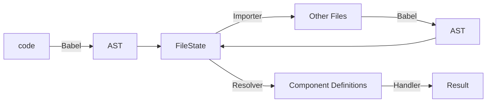

# 概要

本記事は、[SmartHR Advent Calendar 2023 シリーズ2](https://qiita.com/advent-calendar/2023/smarthr) の7日目です。

本記事では、[Storybook](https://storybook.js.org/) を [React](https://ja.react.dev/) プロジェクトで使用した場合に内部的に使用される [react-docgen](https://github.com/reactjs/react-docgen) について紹介し、その仕組みを深ぼることで `Storybook` の理解を深めようという記事です。

# バージョン情報

- Storybook v7.6.3 (monorepo)
- react-docgen v7.0.1

# Storybook v7.6.0 のリリース

先日、`Storybook` v7.6.0 がリリースされ、変更内容をまとめたブログが公開されました。
https://storybook.js.org/blog/storybook-7-6/

v7.6.0 は、各種パフォーマンスとUXの改善に加え、次のメジャーバージョンに向けたレガシー機能の非推奨化が中心となっており、きたる v8 にむけた v7 最後のマイナーバージョンになります。

本記事では、上記ブログ内で取り上げられている、**react-docgen upgrade** について深掘りします。

> **react-docgen upgrade**
>
> A major performance upgrade in Storybook 8 will be the switch to react-docgen for autogenerated controls. This might sound small but it will speed up startup times by 2x or more.

どうやら `Storybook` v8 では、なんらかのツールを `react-docgen` に乗り換えることで、(`React` プロジェクトにおける) 初回起動時間が半分になることが見込めるそうです。

乗り換え元ツールが何なのか、どこで使用されているかは、αリリースされた v8 の[マイグレーションガイド](https://github.com/storybookjs/storybook/blob/next/MIGRATION.md) から確認できました。

https://github.com/storybookjs/storybook/blob/next/MIGRATION.md#react-docgen-component-analysis-by-default

> **React-docgen component analysis by default**
>
> In Storybook 7, we used react-docgen-typescript to analyze React component props and auto-generate controls. In Storybook 8, we have moved to react-docgen as the new default.

これによると、[Controls](https://storybook.js.org/docs/essentials/controls) に表示する `React` コンポーネントのメタデータ(propsの型定義など)を解析するために、これまでは [react-docgen-typescript](https://github.com/styleguidist/react-docgen-typescript) が使用されていましたが、`Storybook` v8 からはデフォルトで `react-docgen` が使用されるよう変わるようです。

`Storybook` における `Controls` とは、コンポーネントの props を画面上から差し替え、リアルタイムに描画結果を確認できる仕組みです。普段意識していない方でも、いつのまにかお世話になっている機能でしょう。(以下gif参照)


`react-docgen-typescript` は、元々 `react-docgen` が TypeScript に対応していなかったため、TypeScript 特化版として開発されたようですが、現在では `react-docgen` でも最低限 の TypeScript をサポートするようになったため、乗り換え可能になったように見えます。

マイグレーションガイドには以下の記載もありました。

> react-docgen is dramatically more efficient, shaving seconds off of dev startup times. However, it only analyzes basic TypeScript constructs.
> We feel react-docgen is the right tradeoff for most React projects. However, if you need the full fidelity of react-docgen-typescript, you can opt-in using the following setting in .storybook/main.js:

端的に言うなら

- `react-docgen` は高速だがシンプル
- `react-docgen-typescript` は低速だが多機能

ということでしょう。プロジェクトによって向き不向きがあるように見えます。

しかし、`react-docgen-typescript` の最終リリースは 2021年12月となっており、以下 Issue にて今後もメンテナンスが行わないと宣言されているため、そういった背景からも開発が活発な `react-docgen` を採用したように思えます。

https://github.com/styleguidist/react-docgen-typescript/issues/494

`Storybook` 内で使用するパッケージの切り替えは、設定ファイルにて以下のように出来ます。

```ts:.storybook/main.js
export default {
  typescript: {
    reactDocgen: 'react-docgen', // or react-docgen-typescript
  }
}
```

パッケージの指定がない場合、`Storybook` のバージョンに応じて以下のようにデフォルトパッケージが使用されます。

|Storybook|デフォルトパッケージ|
|---|---|
|7.5.0|`react-docgen-typescript`|
|7.6.0|`react-docgen-typescript`|
|8.0.0|`react-docgen`|

実際に手元のプロジェクトにて `react-docgen` を使用するように変更してみたところ、初回起動時間が半分とまでは行かずとも、十分な高速化を体感することができました。

ここからは、今後デフォルトとなる `react-docgen` について深掘りしてみましょう。

# react-docgen について

`react-docgen` は、`React` コンポーネントのソースコードから、props の型定義などのコンポーネントメタデータを抽出し、JSON などで出力できるツールです。

https://github.com/reactjs/react-docgen

例として、以下のような TypeScript で書かれた `React` コンポーネントのコードを入力します。

```ts
import React from 'react'

type Props = {
  literal: "foo" | "bar" | "baz";
  object: {
    foo?: string;
    bar: number;
  };
  array?: Array<number | string>;
  func: (foo: string) => number;
};

/**
  Sample Component
**/
export const MyComponent: React.FC<Props> = ({ literal, object, array = [], func }) => {
  return <div>MyComponent</div>
};

```

ソースコードが解析され、以下のような JSON が生成されました。

```json
[
  {
    "description": "Sample Component",
    "displayName": "MyComponent",
    "methods": [],
    "props": {
      "literal": {
        "required": true,
        "tsType": {
          "name": "union",
          "raw": "\"foo\" | \"bar\" | \"baz\"",
          "elements": [
            {
              "name": "literal",
              "value": "\"foo\""
            },
            {
              "name": "literal",
              "value": "\"bar\""
            },
            {
              "name": "literal",
              "value": "\"baz\""
            }
          ]
        },
        "description": ""
      },
      "object": {
        "required": true,
        "tsType": {
          "name": "signature",
          "type": "object",
          "raw": "{\n  foo?: string;\n  bar: number;\n}",
          "signature": {
            "properties": [
              {
                "key": "foo",
                "value": {
                  "name": "string",
                  "required": false
                }
              },
              {
                "key": "bar",
                "value": {
                  "name": "number",
                  "required": true
                }
              }
            ]
          }
        },
        "description": ""
      },
      "array": {
        "required": false,
        "tsType": {
          "name": "Array",
          "elements": [
            {
              "name": "union",
              "raw": "number | string",
              "elements": [
                {
                  "name": "number"
                },
                {
                  "name": "string"
                }
              ]
            }
          ],
          "raw": "Array<number | string>"
        },
        "description": "",
        "defaultValue": {
          "value": "[]",
          "computed": false
        }
      },
      "func": {
        "required": true,
        "tsType": {
          "name": "signature",
          "type": "function",
          "raw": "(foo: string) => number",
          "signature": {
            "arguments": [
              {
                "type": {
                  "name": "string"
                },
                "name": "foo"
              }
            ],
            "return": {
              "name": "number"
            }
          }
        },
        "description": ""
      }
    }
  }
]
```

上記の通り、 `React` コンポーネントのソースコード内で定義されている情報から、以下のようなメタデータが抽出できます。

- コンポーネント名
- ドキュメンテーションコメント
- props
  - required or optional
  - 型情報
  - デフォルト値
  - ドキュメンテーションコメント

`react-docgen-typescript` と比べると機能が限られるとは言われていますが、これだけ見ると十分実用的そうですね。

# react-docgen を使ってみる

`react-docgen` は基本となるライブラリと、それを用いた CLI の2種類のパッケージが公開されています。

CLI は以下のように使用することで、簡単にメタデータを抽出することができます。

```bash
$ yarn add -D @react-docgen/cli
$ yarn react-docgen component.ts -o result.json --pretty
```

今回は、より中身を深ぼるために、ライブラリを直接使用してみましょう。

```bash
$ yarn add react-docgen
```

`react-docgen` では様々なカスタマイズが可能ではありますが、ここではシンプルにデフォルトの挙動のまま、 `parse` 関数を使用してみます。

```ts
import { parse } from 'react-docgen'

const code = `
type Props = {
  name?: string
}

/** My first component */
export const MyComponent: React.FC<Props> = ({ name = 'no_name'} ) => {
  return <div>Hello, {name}!</div>
}
`

const documentation = parse(code)

console.log(documentation)
```

`parse` 関数にソースコードの文字列を渡すだけで、以下のようなパース結果のオブジェクトを取得できます。基本はこれだけです。

```ts
[
  {
    "description": "My first component",
    "displayName": "MyComponent",
    "methods": [],
    "props": {
      "name": {
        "defaultValue": {
          "value": "'no_name'",
          "computed": false
        },
        "required": false
      }
    }
  }
]
```

では、この `parse` 関数を軸にその仕組みを追ってみましょう。

# react-docgen の仕組み

`react-docgen` は、どのようにして `React` コンポーネントのソースコードからメタデータを抽出しているのでしょうか。

`package.json` を覗いてみると、[Babel](https://babeljs.io/) を使用してAST を生成し、そこから情報を抜き出していることが想像できます。

https://github.com/reactjs/react-docgen/blob/d82af943c6953920bfb2850552cafd9286531e98/packages/react-docgen/package.json#L41-L52

それを踏まえた上で、先程使用した `parse` 関数について調べてみます。

https://github.com/reactjs/react-docgen/blob/d82af943c6953920bfb2850552cafd9286531e98/packages/react-docgen/src/parse.ts#L43-L48

やはり `parse` 関数では、はじめにコードを `babel` を用いてパースし、AST を取得しているように見えます。

`babelParser` 関数の中身も、細かいオプションの調整はあるものの、基本的には `@babe/core` の `parseSync` を呼び出しているのみです。

https://github.com/reactjs/react-docgen/blob/d82af943c6953920bfb2850552cafd9286531e98/packages/react-docgen/src/babelParser.ts#L71-L88

:::message
ちなみに `babel` と聞くとモダンJavaScriptへのトランスパイルといった機能を想像しますが、それは Babel プラグインの機能であり、 `@babel/core` の持つ基本的な機能は AST を生成し、(必要に応じて)それを書き換えるインタフェースを提供することです。
:::

`babel` によって生成された AST は、`FileState` という、`react-docgen` 側で定義されたクラスのインスタンスに変換され、`runResolver` 関数によってコンポーネントの情報が抽出されます。

https://github.com/reactjs/react-docgen/blob/d82af943c6953920bfb2850552cafd9286531e98/packages/react-docgen/src/parse.ts#L50-L56

上記コードにおける `importer` は、ソースコード内で他のモジュールへの依存(≒`import`)がある場合に、適切に該当ファイルを探索し、そちらも AST 化して型情報を抜き出します。これによって、ソースコード内には直接含まれていない、外部モジュールに依存した型も解決できるようです。

`resolver` は、AST 全体からコンポーネント定義に関わるノードを見つける関数で、AST からクラスコンポーネントや関数コンポーネント、ESM 形式や CJS 形式など様々なパターンを抽出します。

最後に `handlers` を使用して、コンポーネント定義に関わる AST から情報を抜き出します。
https://github.com/reactjs/react-docgen/blob/d82af943c6953920bfb2850552cafd9286531e98/packages/react-docgen/src/parse.ts#L62

`handlers` はデフォルトで以下のようなものが使用されます。

https://github.com/reactjs/react-docgen/blob/d82af943c6953920bfb2850552cafd9286531e98/packages/react-docgen/src/config.ts#L50-L62

例えば [displayNameHandler](https://react-docgen.dev/docs/reference/handlers/display-name-handler) は、クラス名や関数名などを元に、コンポーネント名の情報を抜き出し、 [defaultPropsHandler](https://react-docgen.dev/docs/reference/handlers/default-props-handler) は props のデフォルト値にあたる情報を抜き出すなどです。

以上のように、 `react-docgen` では `Babel` を用いて生成した AST をベースに、 `importer` `resolver` `handler` と協調してコンポーネントのメタデータを抽出しているようです。



# Storybook での使用例

さて、`Storybook` では `Controls` の機能の内部で `react-docgen` を使用しているとのことでした。具体的にどのように使用しているのでしょうか。

`react-doc-gen` を使用した仕組みは、`Storybook` のビルドに [Webpack](https://webpack.js.org/) を使用している場合はローダーとして、[Vite](https://ja.vitejs.dev/) を使用している場合はプラグインとして提供されます。ここでは `Webpack` の場合を深掘ります。

:::message
ここからは `Webpack` に関する用語・概念が登場しますが、詳しくない方も雰囲気で読んでいただいて大丈夫です。また、`Vite` を使用する場合も大きな違いはありません。
:::

[@storybook/react-webpack5](https://www.npmjs.com/package/@storybook/react-webpack5) では、`Webpack` 向けのローダーとして、 `react-docgen-loader` が提供されています。

https://github.com/storybookjs/storybook/blob/3bcca2d4765c1f6b8aaf87ce70916d51cac743c1/code/presets/react-webpack/src/loaders/react-docgen-loader.ts#L61-L116

ローダーは簡単に言うと、`Webpack` によってモジュール解決が行われる際に、対象ファイルの拡張子に応じてプリプロセスを挟むことで、`JavaScript` として解釈可能なよう変換を行う仕組みです。

例えば [ts-loader](https://github.com/TypeStrong/ts-loader) の場合、`.ts` ファイルなどの依存解決時にコンパイルや型チェックを行うといった仕組みです。

`react-docgen-loader` がどのファイルに対して使用されるかは、 `Webpack` の設定ファイルから確認できます。以下は `Storybook` にて `React` プロジェクトを `Webpack` でビルドする際のデフォルトの設定ファイルです。

https://github.com/storybookjs/storybook/blob/3bcca2d4765c1f6b8aaf87ce70916d51cac743c1/code/presets/react-webpack/src/framework-preset-react-docs.ts#L22-L45

`.storybook/main.js` で設定した `reactDocgen` オプションの値によって使用するローダーが決定しており、`reactDocgen: "react-docgen"` が設定されている場合、`/\.(cjs|mjs|tsx?|jsx?)$/` を満たすファイルを解決する際に `react-docgen-loader` が使用されることがわかります。

ローダー側の実装に戻ります。ローダーでは当然 `react-docgen` を使用して、`Webpack` が解決しようとしているファイルのソースを `parse` 関数に渡し、メタデータを取り出しています。

https://github.com/storybookjs/storybook/blob/afc4c2f4cfc23739b5086a5294eb52e8706d0925/code/presets/react-webpack/src/loaders/react-docgen-loader.ts#L73-L84

ここで、取り出したメタデータをJSON文字列化し、**なんと元のソースコードを拡張して変数に代入するようにコードを改変しています。なんとパワフルな。**

https://github.com/storybookjs/storybook/blob/afc4c2f4cfc23739b5086a5294eb52e8706d0925/code/presets/react-webpack/src/loaders/react-docgen-loader.ts#L86-L94

`Storybook` で描画する `React` コンポーネント内に、`__docgenInfo` というフィールドが生える形になりました。

こうなってしまえば、あとは描画の際にいくらでも参照可能です。型情報はこのように取得されていたんですね。

https://github.com/storybookjs/storybook/blob/afc4c2f4cfc23739b5086a5294eb52e8706d0925/code/lib/docs-tools/src/argTypes/docgen/utils/docgenInfo.ts#L14-L16
https://github.com/storybookjs/storybook/blob/afc4c2f4cfc23739b5086a5294eb52e8706d0925/code/lib/docs-tools/src/argTypes/docgen/extractDocgenProps.ts#L71-L82

:::message
余談ですが、上記コード内のコメントでも触れられているように、[Vue.js](https://ja.vuejs.org/) においても [vue-docgen-api](https://www.npmjs.com/package/vue-docgen-api) という似たような仕組みがあります。
:::

ストーリーファイルにて以下のように描画対象コンポーネントの `__docgenInfo` にアクセスすることで、 `react-docgen` の `parse` 結果が取得できることがわかります。

```tsx:component.stories.tsx
import { Meta, StoryObj } from '@storybook/react'
import { SampleComponent } from './SampleComponent'

export default {
  title: 'SampleComponent',
  component: SampleComponent,
  render: (args) => {
    // react-docgen の parse 結果が出力される
    console.log(SampleComponent.__docgenInfo)
    return <SampleComponent {...args} />
  },
  args: {
  },
} satisfies Meta<typeof SampleComponent>
```

ここまで確認したように、`Storybook` では `Webpack` にてビルドされる全ての `js` `ts` `jsx` `tsx` などのファイルに対して `react-docgen` での `parse` が実行されることがわかります。

頻繁に実行されるからこそ、`react-docgen-typescript` から `react-docgen` に乗り換えることで塵も積もればのパフォーマンス改善に繋がったのでしょう。

パフォーマンス文脈で言うなら、 `Babel` でパースするよりも、[swc](https://swc.rs/) や [oxc](https://oxc-project.github.io/) のような Rust で書かれたパーサーを使うようになったらもっと早くなるんだろうかと考えたりもできますね。

# 締め

本記事では、`Storybook` 上で `React` コンポーネントの型情報を自動で収集するために使用している `react-docgen` について深掘りました。

普段からお世話になっている `Storybook` ですが、その仕組みはブラックボックスになりがちで、バージョンアップにも積極的な追従が出来ていないことが多かったです。

今回のように、テーマを決めて仕組みを深ぼることで、より `Storybook` を身近に感じ、バージョンアップに追従した最適な構成を自ら設定できるようになりそうなので、OSS コードリーディングも含めて今後も継続的に取り組めたらなと思います。