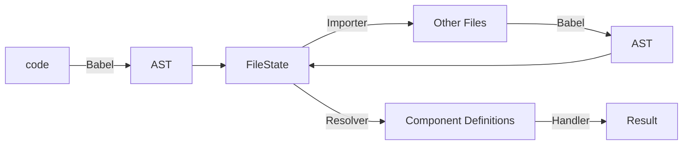

# 概要

本記事は、[SmartHR Advent Calendar 2023](https://qiita.com/advent-calendar/2023/smarthr) のシリーズ2の7日目です。

本記事では、Storybook を [React](https://ja.react.dev/blog/2023/03/16/introducing-react-dev) プロジェクトで使用した場合に内部的に利用される [react-docgen](https://github.com/reactjs/react-docgen) 及び [react-docgen-typescript](https://github.com/styleguidist/react-docgen-typescript) について紹介し、その仕組みを深ぼることで Storybook の理解を深めるようという記事です。

# バージョン情報

- Storybook v7.6.3 (monorepo)
- react-docgen v7.0.1

# Storybook 7.6.0 のリリース

先日、Storybook v7.6.0 がリリースされ、以下ブログにてリリース内容が紹介されています。
https://storybook.js.org/blog/storybook-7-6/

v7.6.0 は、各種パフォーマンスとUXの改善、加えて次のメジャーバージョンに向けたレガシー機能の非推奨化が中心となっており、きたる v8 にむけた v7 最後のパッチバージョンになります。

本記事では、上記ブログ内で取り上げられている、**react-docgen upgrade** について深掘りします。

> **react-docgen upgrade**
>
> A major performance upgrade in Storybook 8 will be the switch to react-docgen for autogenerated controls. This might sound small but it will speed up startup times by 2x or more.

どうやらきたる Storybook v8 では、なんらかのツールを `react-docgen` に乗り換えることで、(React プロジェクトにおける) 初回起動時間が半分になることが見込めるそうです。

乗り換え元ツールが何なのか、何ために使用しているのかは、[MIGRATION.md](https://github.com/storybookjs/storybook/blob/next/MIGRATION.md) から確認できました。

https://github.com/storybookjs/storybook/blob/next/MIGRATION.md#react-docgen-component-analysis-by-default

> **React-docgen component analysis by default**
>
> In Storybook 7, we used react-docgen-typescript to analyze React component props and auto-generate controls. In Storybook 8, we have moved to react-docgen as the new default.

これによると、`Controls` に表示する React コンポーネントのメタデータ(propsの型定義など)を解析するために、これまでは `react-docgen-typescript` を使用していましたが、Storybook 8 からはデフォルトで `react-docgen` が使用されるように変わるそうです。

なお、 `Controls` とは、Storybook における主要機能の一つで、コンポーネントの Props を画面上から差し替え、リアルタイムに描画結果を確認できる仕組みです。(以下gif参照)


`react-docgen`(後述) は、元々 TypeScript に対応していなかったため、TypeScript 対応版として `react-docgen-typescript` が開発されましたが、現在では `react-docgen` でも最低限 の TypeScript をサポートするようになったため、乗り換え可能になったように見えます。

MIGRATION.md には以下の記載もありました。

> react-docgen is dramatically more efficient, shaving seconds off of dev startup times. However, it only analyzes basic TypeScript constructs.
> We feel react-docgen is the right tradeoff for most React projects. However, if you need the full fidelity of react-docgen-typescript, you can opt-in using the following setting in .storybook/main.js:

- `react-docgen` は高速だがシンプル
- `react-docgen-typescript` は低速だが多機能

の違いがあるため、プロジェクトによって使い分けるのが重要なようです。

また、`react-docgen-typescript` は最終リリースが 2021年12月で、メンテナンスが行われていない旨も以下 Issue からも確認できるため、そういった背景からも開発が活発な `react-docgen` を採用したと思えます。

https://github.com/styleguidist/react-docgen-typescript/issues/494

Storybook 上で使用するパッケージの切り替えは、設定ファイルにて以下のように出来ます。

```ts
export default {
  typescript: {
    reactDocgen: 'react-docgen', // or react-docgen-typescript
  }
}
```

パッケージの指定がない場合、Storybook のバージョンに応じて以下のようにデフォルトパッケージが使用されます。

|Storybook|デフォルトパッケージ|
|---|---|
|7.5.0|`react-docgen-typescript`|
|7.6.0|`react-docgen-typescript`|
|8.0.0|`react-docgen`|

ここからは、今後デフォルトとなる `react-docgen` について深掘りしてみましょう。

# react-docgen について

改めまして、[react-docgen](https://github.com/reactjs/react-docgen) は、React コンポーネントのソースコードから、Props の型定義などのコンポーネントメタデータを抽出し、JSON などで出力できるツールです。

https://github.com/reactjs/react-docgen

例として、以下のような TypeScript で書かれた React コンポーネントのコードを入力します。

```ts
import React from 'react'

type Props = {
  literal: "foo" | "bar" | "baz";
  object: {
    foo?: string;
    bar: number;
  };
  array?: Array<number | string>;
  func: (foo: string) => number;
};

/**
  Sample Component
**/
export const MyComponent: React.FC<Props> = ({ literal, object, array = [], func }) => {
  return <div>MyComponent</div>
};

```

ソースコードが解析され、以下のような JSON が生成されます。

```json
[
  {
    "description": "Sample Component",
    "displayName": "MyComponent",
    "methods": [],
    "props": {
      "literal": {
        "required": true,
        "tsType": {
          "name": "union",
          "raw": "\"foo\" | \"bar\" | \"baz\"",
          "elements": [
            {
              "name": "literal",
              "value": "\"foo\""
            },
            {
              "name": "literal",
              "value": "\"bar\""
            },
            {
              "name": "literal",
              "value": "\"baz\""
            }
          ]
        },
        "description": ""
      },
      "object": {
        "required": true,
        "tsType": {
          "name": "signature",
          "type": "object",
          "raw": "{\n  foo?: string;\n  bar: number;\n}",
          "signature": {
            "properties": [
              {
                "key": "foo",
                "value": {
                  "name": "string",
                  "required": false
                }
              },
              {
                "key": "bar",
                "value": {
                  "name": "number",
                  "required": true
                }
              }
            ]
          }
        },
        "description": ""
      },
      "array": {
        "required": false,
        "tsType": {
          "name": "Array",
          "elements": [
            {
              "name": "union",
              "raw": "number | string",
              "elements": [
                {
                  "name": "number"
                },
                {
                  "name": "string"
                }
              ]
            }
          ],
          "raw": "Array<number | string>"
        },
        "description": "",
        "defaultValue": {
          "value": "[]",
          "computed": false
        }
      },
      "func": {
        "required": true,
        "tsType": {
          "name": "signature",
          "type": "function",
          "raw": "(foo: string) => number",
          "signature": {
            "arguments": [
              {
                "type": {
                  "name": "string"
                },
                "name": "foo"
              }
            ],
            "return": {
              "name": "number"
            }
          }
        },
        "description": ""
      }
    }
  }
]
```

上記の通り、 React コンポーネントのソースコード内で定義されている情報から、以下のようなメタデータが抽出できます。

- コンポーネント名
- ドキュメンテーションコメント
- Props
  - required or optional
  - 型情報
  - デフォルト値
  - ドキュメンテーションコメント

`react-docgen-typescript` と比べると機能が限られるとは言われていますが、これだけ見ると十分実用的そうですね。

# react-docgen を使ってみる

`react-docgen` は基本となるライブラリと、それを用いた CLI の2種類のパッケージが公開されています。

CLI は以下のように使用することで、簡単にメタデータを抽出することができます。

```bash
$ yarn add -D @react-docgen/cli
$ yarn react-docgen component.ts -o result.json --pretty
```

今回は、より中身を深ぼるために、ライブラリを直接使用してみましょう。

```bash
$ yarn add react-docgen
```

`react-docgen` では様々なカスタマイズが可能ではありますが、ここではシンプルにデフォルトの挙動のまま、 `parse` 関数を使用してみます。

```ts
import { parse } from 'react-docgen'

const code = `
type Props = {
  name?: string
}

/** My first component */
export const MyComponent: React.FC<Props> = ({ name = 'no_name'} ) => {
  return <div>Hello, {name}!</div>
}
`

const documentation = parse(code)

console.log(documentation)
```

`parse` 関数にソースコードの文字列を渡すだけで、以下のようなパース結果のオブジェクトを取得できます。基本はこれだけですね。

```ts
[
  {
    "description": "My first component",
    "displayName": "MyComponent",
    "methods": [],
    "props": {
      "name": {
        "defaultValue": {
          "value": "'no_name'",
          "computed": false
        },
        "required": false
      }
    }
  }
]
```

では、この `parse` 関数を軸にその仕組みを追ってみましょう。

# react-docgen の仕組み

`react-docgen` は、どのようにして React コンポーネントのソースコードからメタデータを抽出しているのでしょうか。

`package.json` を覗いてみると、`babel` が使用されており、これを用いて AST を生成してそこから情報を抜き出すことが想像できます。

https://github.com/reactjs/react-docgen/blob/d82af943c6953920bfb2850552cafd9286531e98/packages/react-docgen/package.json#L41-L52

それを踏まえた上で、先程使用した `parse` 関数について調べてみます。

https://github.com/reactjs/react-docgen/blob/d82af943c6953920bfb2850552cafd9286531e98/packages/react-docgen/src/parse.ts#L43-L48

やはり `parse` 関数では、はじめにコードを `babel` を用いてパースし、AST を取得しているように見えます。

`babelParser` 関数の中身も、細かいオプションの調整はあるものの、基本的には `@babe/core` の `parseSync` を呼び出しているのみです。

https://github.com/reactjs/react-docgen/blob/d82af943c6953920bfb2850552cafd9286531e98/packages/react-docgen/src/babelParser.ts#L71-L88

ちなみに `babel` と言えばコードのトランスパイルを想像しますが、それは Babel プラグインの機能であり、 `@babel/core` の持つ基本的な昨日は AST を生成し、(必要に応じて)それを書き換えるインタフェースを提供することです。

`babel` によって生成された AST は、`FileState` という、`react-docgen` 側で定義されたインスタンスに変換され、`runResolver` 関数によってコンポーネントの情報が抽出されます。

https://github.com/reactjs/react-docgen/blob/d82af943c6953920bfb2850552cafd9286531e98/packages/react-docgen/src/parse.ts#L50-L56

上記コードにおける `importer` はソースコード内で他のモジュールへの依存(`import`)がある場合に、適切に該当ファイルを参照し、そちらも AST 化し、`export` している型定義などを参照できるようにします。

`resolver` は、AST 全体から、コンポーネント定義に関わるノードを見つける関数で、AST からクラスコンポーネントや関数コンポーネント、ESM 形式や CJS 形式など様々なパターンを抽出します。

最後に `handlers` を使用して、コンポーネント定義に関わる AST から情報を抜き出します。
https://github.com/reactjs/react-docgen/blob/d82af943c6953920bfb2850552cafd9286531e98/packages/react-docgen/src/parse.ts#L62

`handlers` はデフォルトで以下のようなものが使用されます。

https://github.com/reactjs/react-docgen/blob/d82af943c6953920bfb2850552cafd9286531e98/packages/react-docgen/src/config.ts#L50-L62

例えば [displayNameHandler](https://react-docgen.dev/docs/reference/handlers/display-name-handler) は、クラス名や関数名などを元に、コンポーネント名の情報を抜き出し、 [defaultPropsHandler](https://react-docgen.dev/docs/reference/handlers/default-props-handler) は props のデフォルト値にあたる情報を抜き出します。

以上のように、 `react-docgen` では `Babel` を用いて生成した AST をベースに、 `importer` `resolver` `handler` を経て、コンポーネントのメタデータを抽出しているようです。



# Storybook での使用例

さて、Storybook では、 `Controls` の機能の一環として `react-docgen` を使用しているとのことでした。

`react-doc-gen` を使用した仕組みは、Storybook のビルドに `Webpack` を使用している場合はローダーとして、`Vite` を使用している場合は Vite プラグインとして提供されますが、ここでは前者について深掘ります。

:::message
ここからは `Webpack` に関する用語・概念が登場しますが、詳しくない方も雰囲気で読んでいただいて大丈夫です。
:::

`Webpack` 向けのローダーとして、 `react-docgen-loader` が提供されています。

https://github.com/storybookjs/storybook/blob/3bcca2d4765c1f6b8aaf87ce70916d51cac743c1/code/presets/react-webpack/src/loaders/react-docgen-loader.ts
https://github.com/storybookjs/storybook/blob/3bcca2d4765c1f6b8aaf87ce70916d51cac743c1/code/presets/react-webpack/src/loaders/react-docgen-loader.ts#L61-L116

ローダーは簡単に言うと、`Webpack` によってモジュール解決が行われる際に、拡張子に応じた前処理を挟むことが出来る仕組みです。例えば `ts-loader` の場合、`.ts` ファイルの依存解決時に `tsc` によってコンパイルを行うといった仕組みです。

`react-docgen-loader` をいつ使用するかは、Storybook が使用する `Webpack` の設定ファイルから確認できます。

https://github.com/storybookjs/storybook/blob/3bcca2d4765c1f6b8aaf87ce70916d51cac743c1/code/presets/react-webpack/src/framework-preset-react-docs.ts#L22-L45

`reactDocgen` オプションの値によって使用するローダーが決定しており、`/\.(cjs|mjs|tsx?|jsx?)$/` を満たすファイルを解決する際に `react-docgen-loader` が使用されることがわかります。

ローダー側の実装に戻ります。ローダーでは当然 `react-docgen` を使用して、`Webpack` が解決しようとしているファイルのソースを `parse` 関数に渡し、メタデータを取り出しています。

https://github.com/storybookjs/storybook/blob/afc4c2f4cfc23739b5086a5294eb52e8706d0925/code/presets/react-webpack/src/loaders/react-docgen-loader.ts#L73-L84

取り出したメタデータをJSON文字列化し、なんと元のソースコードを拡張して変数に代入するようにコードを改変しています。なんとパワフルな。

https://github.com/storybookjs/storybook/blob/afc4c2f4cfc23739b5086a5294eb52e8706d0925/code/presets/react-webpack/src/loaders/react-docgen-loader.ts#L86-L94

Storybook で描画する React コンポーネント内に、`__docgenInfo` という変数が生える形になりました。

こうなってしまえば、あとは描画の際にいくらでも参照可能です。型情報はこのように取得されていたんですね。

https://github.com/storybookjs/storybook/blob/afc4c2f4cfc23739b5086a5294eb52e8706d0925/code/lib/docs-tools/src/argTypes/docgen/utils/docgenInfo.ts#L14-L16
https://github.com/storybookjs/storybook/blob/afc4c2f4cfc23739b5086a5294eb52e8706d0925/code/lib/docs-tools/src/argTypes/docgen/extractDocgenProps.ts#L71-L82

# 締め

本記事では、Storybook 上で React コンポーネントの型情報を自動で取得するために使用している `react-docgen` について深掘りました。

普段からお世話になっている Storybook ですが、その仕組みはブラックボックスになりがちで、バージョンアップにも積極的な追従が出来ていないことが多かったです。

今回のように、テーマを決めて仕組みを深ぼることで、より Storybook を身近に感じ、バージョンアップに追従した最適な構成を自ら設定できるようになりそうなので、OSS コードリーディングも含めて今後も継続的に取り組めたらなと思います。