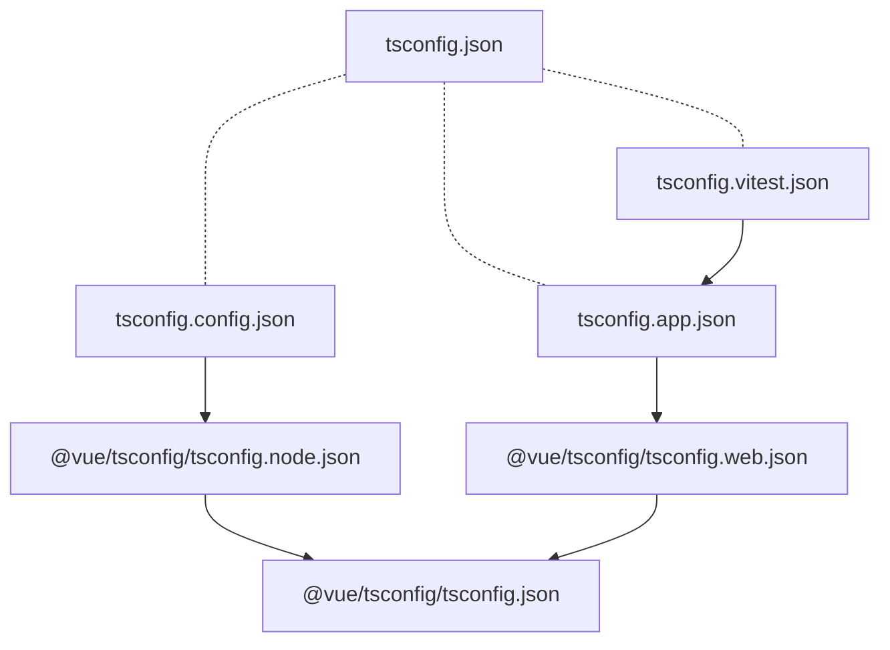
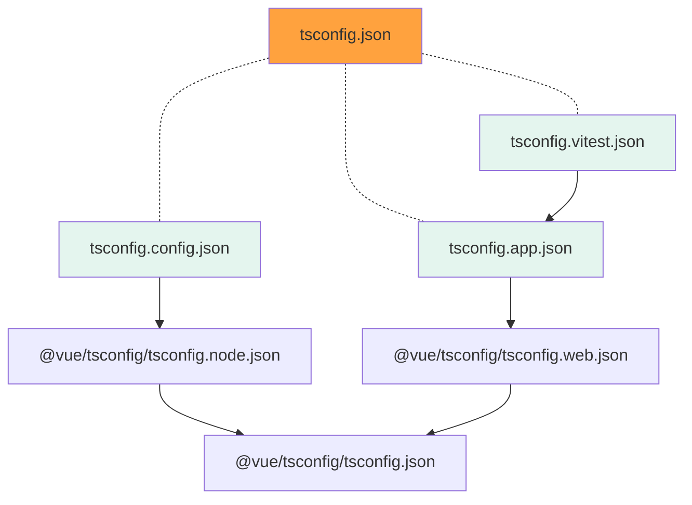
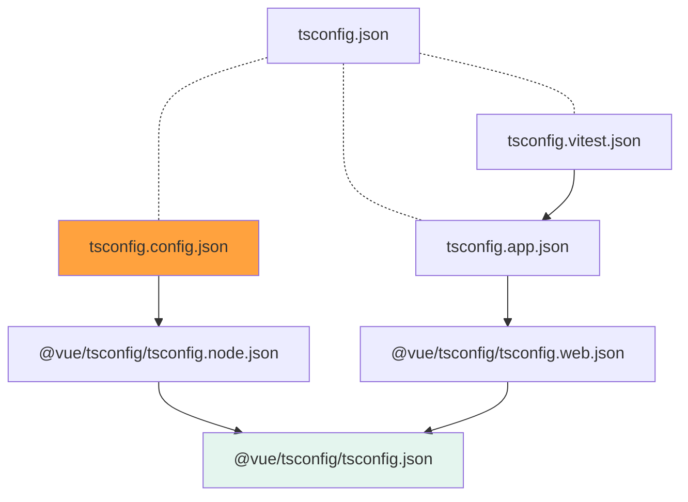
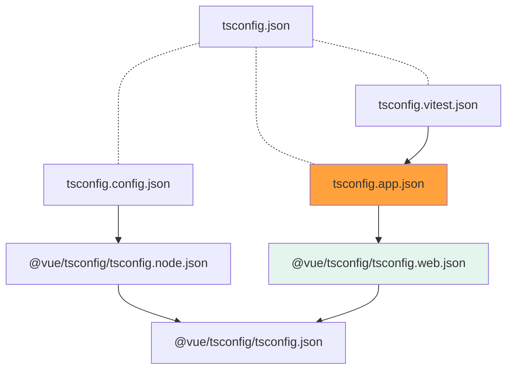
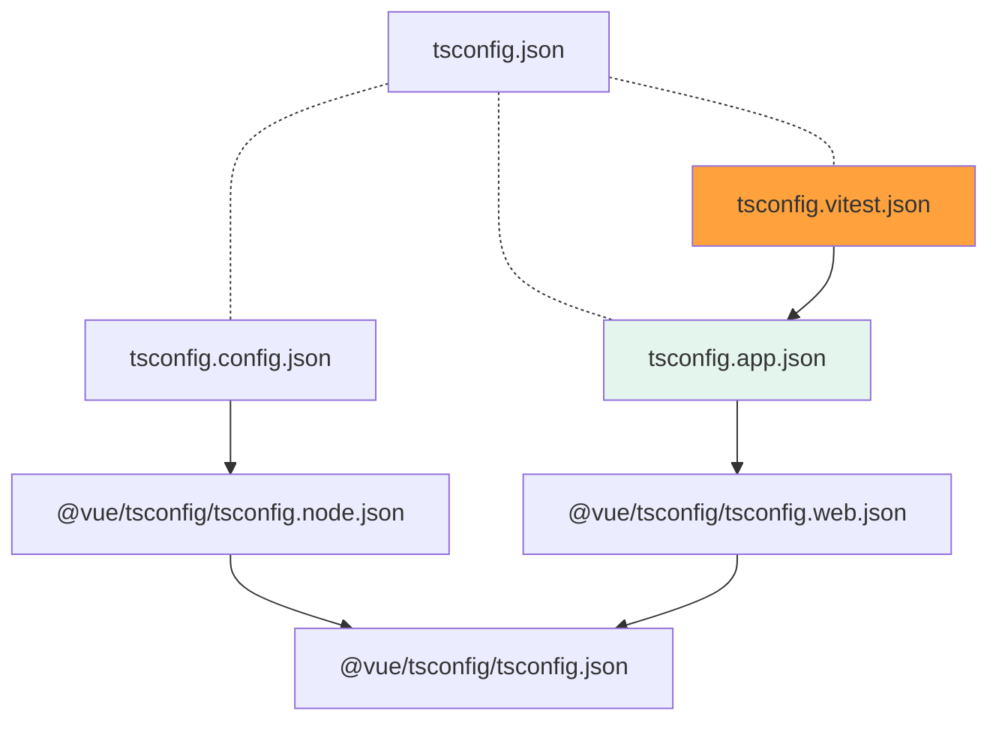
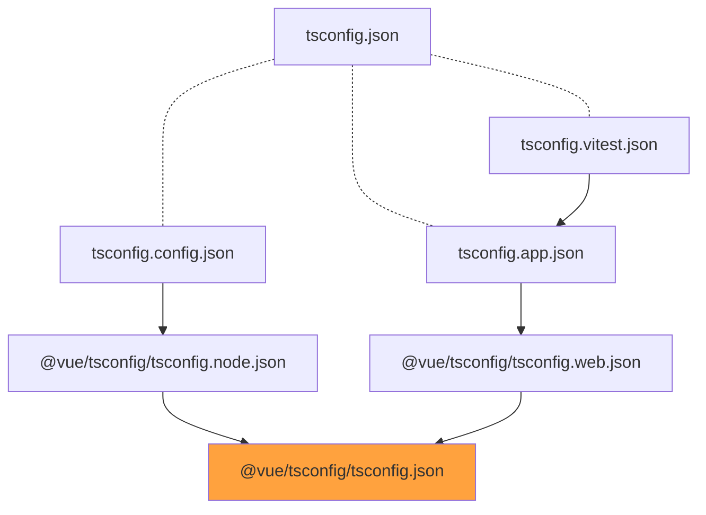

# 概要

本記事は、 [Vue.js](https://v3.ja.vuejs.org/) の公式ツールである [create-vue](https://github.com/vuejs/create-vue) によって生成された [tsconfig.json](https://www.typescriptlang.org/ja/tsconfig) を元に、 Vue 3 + TypeScript における、 `tsconfig` のベストプラクティスを理解しようという内容です。

# 注意事項

私自身はまだまだ Vue 及び TypeScript の理解が不十分であるため、誤った解釈を含んでいる可能性があるのでご注意ください。

なにか間違いなどにお気付きの場合は、コメントまたは GitHub での編集提案を頂けると幸いです。

# create-vue について

[create-vue](https://github.com/vuejs/create-vue) は、[Vite](https://ja.vitejs.dev/) ベースの Vue プロジェクトを CLI から簡易的に構築するためのツールです。

```bash
npm init vue@3
```

のようにコマンドを実行し、対話形式の質問に解答することで、ビルド設定から周辺ライブラリの追加、テストやリンター、フォーマッターのセットアップまで行ってくれる優れものです。

本記事では `create-vue` によって生成されたプロジェクト構成が、現在の Vue におけるベストプラクティスであるという前提の元、生成された `tsconfig` を深堀ります。

なお、本記事では `create-vue` のバージョンは [v3.3.4](https://github.com/vuejs/create-vue/releases/tag/v3.3.4) を使用します。

# プロジェクト作成

本記事では以下のようにプロジェクトをセットアップします。

```bash
$ npm init vue@3

Vue.js - The Progressive JavaScript Framework

✔ Project name: … vue-project
✔ Add TypeScript? …  Yes
✔ Add JSX Support? … No
✔ Add Vue Router for Single Page Application development? … No
✔ Add Pinia for state management? … No
✔ Add Vitest for Unit Testing? … Yes
✔ Add Cypress for End-to-End testing? … No
✔ Add ESLint for code quality? … No
```

TypeScript の有効化と、 [Vitest](https://vitest.dev/) のセットアップのみ行っています。

[VueRouter](https://router.vuejs.org/), [Pinia](https://pinia.vuejs.org/), [Cypress](https://www.cypress.io/), [ESLint](https://eslint.org/), [Prettier](https://prettier.io/) のセットアップも可能ですが、これらは TypeScript の設定には影響しないため、省略しています。

# package.json

スキャフォールドされたプロジェクトの `package.json` は以下になります。

```json:package.json
{
  "name": "vue-project",
  "version": "0.0.0",
  "scripts": {
    "dev": "vite",
    "build": "run-p type-check build-only",
    "preview": "vite preview --port 4173",
    "test:unit": "vitest --environment jsdom",
    "build-only": "vite build",
    "type-check": "vue-tsc --noEmit -p tsconfig.vitest.json --composite false"
  },
  "dependencies": {
    "vue": "^3.2.38"
  },
  "devDependencies": {
    "@types/jsdom": "^20.0.0",
    "@types/node": "^16.11.56",
    "@vitejs/plugin-vue": "^3.0.3",
    "@vue/test-utils": "^2.0.2",
    "@vue/tsconfig": "^0.1.3",
    "jsdom": "^20.0.0",
    "npm-run-all": "^4.1.5",
    "typescript": "~4.7.4",
    "vite": "^3.0.9",
    "vitest": "^0.23.0",
    "vue-tsc": "^0.40.7"
  }
}
```

TypeScript 関連として、以下パッケージが追加されています。

- [`@types/jsdom`](https://www.npmjs.com/package/@types/jsdom): [jsdom](https://github.com/jsdom/jsdom) の型パッケージ
- [`@types/node`](https://www.npmjs.com/package/@types/node): [Node.js](https://nodejs.org/en/) のビルトインモジュールの型パッケージ
- [`@vue/tsconfig`](https://github.com/vuejs/tsconfig): Vue プロジェクト向けの TSConfig のベース

# tsconfig の全体像

詳細については順に述べますが、 `create-vue` で生成される tsconfig は、以下のグラフのように複数の設定ファイルから構成されています。



上記グラフにて、破線は参照(`references`)、矢印は継承(`extends`) を表します。

また、 `@vue/tsconfig` プレフィックスの設定は、 `@vue/tsconfig` パッケージでさらに切り出された別の設定ファイルを表します。

https://github.com/vuejs/tsconfig

以上をふまえて、順に各設定ファイルの中身を覗いてみましょう。

# tsconfig.json

まずプロジェクトの TypeScript 設定のベースとなる、`tsconfig.json` です。



```json:tsconfig.json
{
  "files": [],
  "references": [
    {
      "path": "./tsconfig.config.json"
    },
    {
      "path": "./tsconfig.app.json"
    },
    {
      "path": "./tsconfig.vitest.json"
    }
  ]
}
```

`references` という見慣れないフィールドが定義されていますが、これは `Project References` という TypeScript の機能です。

https://www.typescriptlang.org/docs/handbook/project-references.html

https://zenn.dev/katsumanarisawa/articles/58103deb4f12b4

`Project References` は複雑な仕組みではありますが、ここでは TypeScript プロジェクトを `tsconfig.config.json` `tsconfig.app.json` `tsconfig.vitest.json` の3種類の設定ファイルに基づいて論理分割していると考えて頂ければ大丈夫です。

ルートプロジェクト (`tsconfig.json`) 自体は、分割された3プロジェクトに依存しているだけで自身は何もしないため、 `files` フィールドが空になっています。

依存するそれぞれのプロジェクトは以下の役割を持っています。

|設定ファイル名|役割|
|---|---|
|`tsconfig.config.json`|`vite.config.ts` などの設定ファイルを TypeScript で書けるようにする|
|`tsconfig.app.json`|アプリケーションコードを TypeScript で書けるようにする|
|`tsconfig.vitest.json`|`vitest` によるテストコードを TypeScript で書けるようにする|

上記のようにプロジェクトを論理分割することで、単一のプロジェクトでまとめる場合に比べ、以下のようなメリットが得られます

- アプリコードからテストコードを `import` するような歪な依存を防げる
- アプリコードはブラウザで動作するが、テストコードは Node 上で動作するため、それぞれで使用できるモジュールを制限できる
- ビルドの対象を制限することでパフォーマンスが向上する

参照する各設定ファイルについても覗いてみましょう。

# tsconfig.config.json

`tsconfig.config.json` は、各種ツールに関する設定ファイルを TypeScript で書くための設定です。



```json:tsconfig.config.json
{
  "extends": "@vue/tsconfig/tsconfig.node.json",
  "include": ["vite.config.*", "vitest.config.*", "cypress.config.*"],
  "compilerOptions": {
    "composite": true,
    "types": ["node"]
  }
}
```

## extends

```json
"extends": "@vue/tsconfig/tsconfig.node.json",
```

`extends` している継承元の設定は `@vue/tsconfig` に含まれる Node 向けの設定で、以下のようになっています。

https://github.com/vuejs/tsconfig/blob/main/tsconfig.node.json

上記設定ではさらに `./tsconfig.json` を `extends` していますが、これは他の設定ファイル (`tsconfig.app.json`, `tsconfig.vitest.json`) でも共通なので後述します。 `compilerOptions` についても、同様の設定を継承先で行っているので割愛します。

## includes

ここでは以下のように、 `vite` `vitest` `cypress` それぞれの設定ファイルのみをビルドの対象としています。

```json
"include": ["vite.config.*", "vitest.config.*", "cypress.config.*"],
```

**このように、 `Project References` を用いることで、ファイル単位でのプロジェクトの論理分割が出来ていることがわかります。**

## compilerOptions

```json
  "compilerOptions": {
    "composite": true,
    "types": ["node"]
  }
```

`vite` `vitest` `cypress` はいずれも Node 上で動作するため、Node のビルトインモジュールを参照することができます。そのため、 `"types": ["node"]` を指定することで TypeScript からそれにアクセスできるようにします。

また、 `"composite": true` は、 `Project References` において、このプロジェクトが他のプロジェクトから参照されることがあるという宣言になります。この設定がある場合にプロジェクトを正しく参照できるようにするためのいくつかの制約が発生しますが、詳細は以下ドキュメントを参照ください。

https://www.typescriptlang.org/ja/tsconfig#composite


# tsconfig.app.json

`tsconfig.app.json` は、アプリケーションコードを TypeScript で書くための設定です。



```json:tsconfig.app.json
{
  "extends": "@vue/tsconfig/tsconfig.web.json",
  "include": ["env.d.ts", "src/**/*", "src/**/*.vue"],
  "exclude": ["src/**/__tests__/*"],
  "compilerOptions": {
    "composite": true,
    "baseUrl": ".",
    "paths": {
      "@/*": ["./src/*"]
    }
  }
}
```

## extends

```json
"extends": "@vue/tsconfig/tsconfig.web.json",
```

`extends` している継承元の設定は `@vue/tsconfig` に含まれる Web 向けの設定で、以下のようになっています。

https://github.com/vuejs/tsconfig/blob/main/tsconfig.web.json

Vue 3 は [Proxy](https://developer.mozilla.org/ja/docs/Web/JavaScript/Reference/Global_Objects/Proxy) をに、依存していることもあり、JavaScript の最低バージョンは `ES2016` になります。

また、当然ブラウザ上で動作するコードにになるため、 `DOM` 及び `DOM.Iterable` も必要になります。

## include

```json
"include": ["env.d.ts", "src/**/*", "src/**/*.vue"]
```

アプリケーションコードは `src` ディレクトリにあるものとし、 `.ts` のほかに `.vue` ファイルも対象とします。

## exclude

```json
"exclude": ["src/**/__tests__/*"]
```

`include` で指定されていた `src` ディレクトリであっても、テストコードを配置する `__tests__` ディレクトリの場合は除外します。

**これによって、アプリケーションコードからテストコードをインポートすることを不可能に出来ます。**

## compilerOptions

```json
  "compilerOptions": {
    "composite": true,
    "baseUrl": ".",
    "paths": {
      "@/*": ["./src/*"]
    }
  }
```

`paths` で指定しているインポートパスの alias は、 Vite 側の以下設定(`resolve.alias['@']`)との整合性のための設定で、絶対パスを用いたモジュールのインポートを簡略化させてくれます。

```ts:vite.config.ts
import { fileURLToPath, URL } from 'node:url'

import { defineConfig } from 'vite'
import vue from '@vitejs/plugin-vue'

// https://vitejs.dev/config/
export default defineConfig({
  plugins: [vue()],
  resolve: {
    alias: {
      '@': fileURLToPath(new URL('./src', import.meta.url))
    }
  }
})
```

# tsconfig.vitest.json

`tsconfig.vitest.json` は、`vitest` によるテストコードを TypeScript で書くための設定です。



```json:tsconfig.vitest.json
{
  "extends": "./tsconfig.app.json",
  "exclude": [],
  "compilerOptions": {
    "composite": true,
    "lib": [],
    "types": ["node", "jsdom"]
  }
}
```

## extends

```json
"extends": "./tsconfig.app.json"
```

`tsconfig.vitest.json` では、これまでとは異なり、先程の `tsconfig.app.json` を継承しています。

テストコードからはアプリケーションコードをインポートすることになるためです。

## exclude

```json
"exclude": [],
```

`tsconfig.app.json` を継承しただけだと、 `exclude` でテストコード (`__tests__`) が除外されてしまい、テストコードを書くことができなくなってしまうため、ここでその設定を破棄しています。

## compilerOptions

```json
  "compilerOptions": {
    "composite": true,
    "lib": [],
    "types": ["node", "jsdom"]
  }
```

テストコードは Node 及び JSDOM 上で実行されるため、それらを利用できるようにします。

# @vue/tsconfig/tsconfig.json

最後に、 `@vue/tsconfig/tsconfig.web.json` 及び `@vue/tsconfig/tsconfig.node.json` それぞれが継承している、大元の `tsconfig.json` です。



ここでは `compilerOptions` のみ定義し、主に `.vue` ファイル内で TypeScript を使用するための基本的なコンパイルオプションが設定されています。

https://github.com/vuejs/tsconfig/blob/main/tsconfig.json

なお、 `.vue` ファイルについては `tsc` では直接型チェックをすることが出来ないので、 `tsc` をラップした `vue-tsc` が使われます。

https://www.npmjs.com/package/vue-tsc

## "jsx": "preserve"

コード中の `JSX` を、 `h()` などのレンダリング関数に置き換えずに、そのまま保持します。

やや違和感があるかもしれませんが、Volar における `<template>` は、 TypeScript では `JSX` として扱うようにしているようです。

## "noImplicitThis": true

Option API においては `this` を通じた Vue インスタンスの参照は頻出のため (`"strict": true` だけでも十分)

## "isolatedModules": true

Vite(esbuild) で TypeScript を解決する場合に、ファイル単体でもビルド可能であることを担保するため

## "preserveValueImports": true

未使用の値インポートをあえて削除しないようにします。

`<script setup>` においては、`<script>` 内でインポートした値を一切使っていなくても、`<template>` にバインドされて参照可能になるため、勝手に削除されることを避けるための設定です。

## "target": "ESNext"

Vite においては TypeScript でなく Vite がコード変換を行うので、ここでは Vite 自体が使用する動的インポートを使えるバージョンにしておきます。

# まとめ

本記事は、 [create-vue](https://github.com/vuejs/create-vue) によって生成された TypeScript の構成を元に、Vue 3 + TypeScript におけるプロジェクト設定のベストプラクティスを模索しました。

特に `Project References` のような、存在は知っていたが挙動を知らない系の仕組みを身近に感じることができたので個人的には満足しています。

また、Vue は TypeScript で扱うことが難しいフレームワークであるため、こういったベストプラクティスを認知しておくことで、いざというときのトラブルシューティングに役立つと思うので、今後もさらなる深堀りをしていきたいと思います。